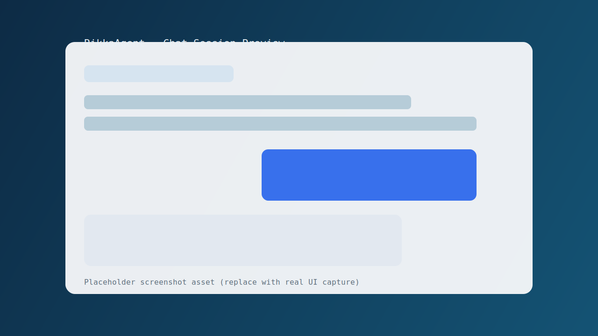
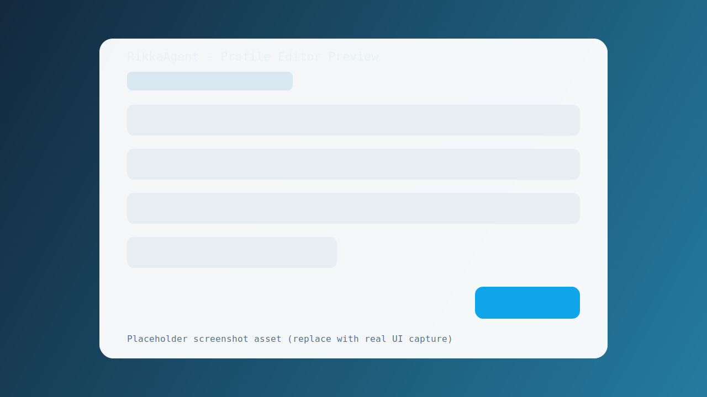
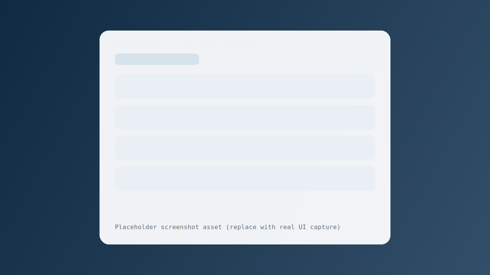

# RikkaAgent

<div align="center">
  

  **The most beautiful SSH client for Android.**

  Execute commands. Run AI tools. Read output like a conversation — not a terminal wall.

  [](https://github.com/DeliciousBuding/RikkaAgent/actions/workflows/ci.yml)
  [](LICENSE)
  [](https://kotlinlang.org/)
  [](https://developer.android.com/jetpack/compose)
  [](app/build.gradle.kts)
  [](https://m3.material.io/)
  [](docs/design-agent-runner.md)

  <br>

  **[Features](#features) · [Screenshots](#screenshots) · [Architecture](#architecture) · [Quick Start](#quick-start) · [Documentation](#documentation) · [Contributing](#contributing)**

  <br>
</div>

---

## Overview

RikkaAgent reimagines server management on mobile. Instead of staring at a wall of monospace terminal text, every SSH command output is rendered as structured, readable chat bubbles — with Markdown, syntax highlighting, and rich cards. It's designed for the operator who needs answers fast: **type a command, read the response, move on.**

Built with [Material You](https://m3.material.io/) design language and aligned with [RikkaHub](https://github.com/re-ovo/rikkahub) (5.5k+ stars), RikkaAgent brings polished, modern UX to remote server administration.

> **Clean-room implementation** under Apache-2.0. Inspired by RikkaHub's design language, built from scratch for the SSH domain.

---

## Features

| Focus | What You Get |
|---|---|
| **Beautiful by design** | Material You dynamic color, 5 preset themes, AMOLED dark mode, 50 semantic colors |
| **Chat-style output** | Commands and output rendered as structured chat bubbles, not raw terminal text |
| **Rich Markdown** | IntelliJ MarkdownParser with syntax highlighting, tables, Mermaid diagrams |
| **Security-first** | Known-hosts TOFU verification, encrypted key storage (AES-256-GCM), explicit credential confirmation |
| **AI-ready** | Remote Codex/Claude Code execution with ChainOfThought reasoning display |
| **Operator velocity** | Copy, rerun, share, export — every action one tap away |
| **i18n** | Full Chinese (Simplified) + English localization across all screens |

### Capability Matrix

| Domain | Status | Notes |
|---|---|---|
| Compose app shell | Done | Profiles, editor, chat session, settings, known hosts, about |
| SSH engine (Mode A) | Done | sshj exec, stdout/stderr/exit streaming, connection reuse |
| Auth chain | Done | Password, key, passphrase, PuTTY `.ppk` |
| Host key safety | Done | TOFU + mismatch warning + replacement confirmation |
| Codex integration | Done | Profile toggle, workdir, API key injection, JSONL events, thread/turn/item progress summary |
| Rendering pipeline | Done | IntelliJ MarkdownParser + CodeCard + truncation/full-output |
| Structured message model | Done | `MessagePart` sealed class: Command, Stdout, Stderr, Text, Code, Reasoning, Error, Mermaid |
| ChainOfThought | Done | Collapsible reasoning card for Codex reasoning steps |
| Syntax highlighting | Done | CodeCard with language-aware coloring (10+ languages) |
| Mermaid rendering | Done | Feature flag, segmented rendering, WebView card, retry + source fallback |
| Lucide icons | Done | Consistent icon set across all screens (Lucide Icons 1.1.0) |
| Material Expressive Theme | Done | `MaterialExpressiveTheme` with AMOLED + dynamic color + extend colors |
| CI quality gate | Done | Unit test + lint + assemble + artifacts + summary |

### Product Boundary

**Included (v1):**
- Non-interactive SSH command execution (exec channel)
- Structured streaming into chat bubbles via `MessagePart` model
- Day-to-day operator workflow (rerun, copy, share, export)
- Markdown rendering with syntax highlighting (IntelliJ MarkdownParser)
- Collapsible ChainOfThought reasoning display for Codex sessions

**Not Included (v1):**
- PTY terminal emulation (`vim`, `top`, `htop`, cursor control)
- Default server-side HTTP command relay
- Fully autonomous remote action without explicit user command

---

## Screenshots

| Chat Session | Profile Editor | Settings |
|---|---|---|
|  |  |  |

| MessageParts Rendering | ChainOfThought | Syntax Highlighting |
|---|---|---|
|  |  |  |

> **Note:** Placeholder SVG assets. Replace with real screenshots before a release tag.

---

## Architecture

### Module Layout

```
:app            -> Screens, Navigation, ViewModels, DI wiring
:core:model     -> Domain models (MessagePart sealed class, ChatMessage, ChatThread, SshProfile)
:core:ssh       -> SSH runner, JSONL parser, host key store interfaces, connection pool
:core:storage   -> Room v5 + DataStore persistence, MessagePartConverter, Migrations
:core:ui        -> Reusable Compose components (MessagePartsBlock, CodeCard, MarkdownText, ChatBubble, ChatInput, MermaidDiagramCard, MeshGradientBackground)
```

### ViewModel Decomposition

The original monolithic `ChatViewModel` has been decomposed into focused collaborators:

```
ChatViewModel (thin orchestrator)
  -> ChatSessionManager   -- thread CRUD, message persistence, title auto-generation
  -> CommandExecutor      -- SSH connection, command execution, output formatting, Codex JSONL
  -> AuthCallbackBroker   -- host key / password / passphrase callback bridging (SharedFlow)
  -> SessionExporter      -- session export to file
  -> CancelMessageHelper  -- cancellation message assembly
  -> OutputFormatter      -- truncation, exit code, stderr formatting
  -> CommandComposer      -- shell wrapping, Codex env injection
  -> CodexProgressFormatter -- thread/turn/item progress rendering
  -> ErrorMessageMapper   -- SSH error category to user-friendly string
```

### MessagePart Model

`ChatMessage` carries a `parts: List<MessagePart>` field for structured, type-safe rendering instead of a flat `content: String`.

| Part Type | Purpose |
|---|---|
| `MessagePart.Command` | Executed command with exit code and timestamp |
| `MessagePart.Stdout` | Stdout chunk (streaming-friendly) |
| `MessagePart.Stderr` | Stderr chunk |
| `MessagePart.Text` | Plain text / Markdown content |
| `MessagePart.Code` | Fenced code block with language tag |
| `MessagePart.Reasoning` | AI reasoning step (ChainOfThought) |
| `MessagePart.Error` | Structured error with cause chain |
| `MessagePart.Mermaid` | Mermaid diagram definition |

> **Backward compatibility:** Old messages with only `content: String` auto-migrate to `parts = listOf(Text(content))` on deserialization.

### Runtime Flow (Mode A)

```
User command
    -> ChatViewModel
    -> CommandExecutor.execute()
    -> SshExecRunner.run(profile, command)
    -> Flow<ExecEvent>
    -> stdout/stderr/structured/exit
    -> MessagePart accumulation
    -> message persistence + UI update via MessagePartsBlock
```

### Technology Stack

| Category | Choice |
|---|---|
| Language | Kotlin 2.1.0 |
| UI | Jetpack Compose (BOM 2024.12) + Material 3 |
| Icons | Lucide Icons 1.1.0 |
| SSH | sshj (BSD 2-Clause) |
| Persistence | Room v5 + DataStore |
| DI | Koin |
| Markdown | commonmark-java (GFM tables, strikethrough) |
| Crypto | AndroidX Security Crypto (AES-256-GCM) |
| CI/CD | GitHub Actions |

---

## Quick Start

### Requirements

- JDK 17+
- Android SDK (target API 35)
- Gradle wrapper (included)

### Build, Test, Lint

```bash
# Run unit tests
./gradlew test

# Lint check
./gradlew :app:lintDevDebug

# Build debug APK
./gradlew assembleDevDebug
```

**Debug APK output:** `app/build/outputs/apk/dev/debug/app-dev-debug.apk`

### Fast Regression (Core Paths)

```bash
./gradlew :core:storage:testDebugUnitTest :core:ssh:testDebugUnitTest :app:testDevDebugUnitTest
```

### UI Regression (Pre-Release)

```bash
./gradlew :app:testDevDebugUnitTest --tests "io.rikka.agent.ui.screen.HostKeyDialogsTest"
./gradlew :app:lintDevDebug :app:assembleDevDebug
```

### Instrumentation Tests

Requires a device or emulator:

```bash
./gradlew :app:connectedDevDebugAndroidTest
```

See [docs/testing-android-instrumentation.md](docs/testing-android-instrumentation.md) for emulator setup tips.

---

## Demo Flow

1. **Create a profile** — Host, port, username, and authentication (password or key).
2. **Test connection** — Verify SSH reachability and trust the host key fingerprint.
3. **Run commands** — Type `uname -a`, `df -h`, or any shell command.
4. **Interact** — Re-run, copy, share, or export output from the action row.
5. **Enable Codex** (optional) — Toggle Codex mode per-profile for JSONL streaming tasks with ChainOfThought reasoning.

---

## FAQ

**Q1: Why RikkaAgent over Termux / ConnectBot / JuiceSSH?**

Termux is a full terminal emulator — powerful but clunky for quick tasks. ConnectBot and JuiceSSH are traditional terminal apps. RikkaAgent is designed for **readability and speed**: every command output is rendered with Markdown, syntax highlighting, and structured cards. It's the tool you reach for when something's broken and you need answers fast — not a wall of monospace text.

**Q2: Why no interactive terminal mode (vim, top, htop)?**

Mode A intentionally focuses on exec-channel reliability and readable output. PTY is out of v1 scope. See [design-pty.md](docs/design-pty.md) for the v2 roadmap.

**Q3: Does RikkaAgent store private keys in plaintext?**

No. App-managed keys are encrypted at rest via AndroidX Security Crypto (AES-256-GCM).

**Q4: Why does host key mismatch require confirmation?**

To reduce MITM risk. Replacing trust should only happen after out-of-band verification.

**Q5: Mermaid diagram shows source code instead of rendering. Why?**

Fallback is intentional when parsing or local rendering fails. The source block remains visible so the session stays readable and recoverable.

**Q6: What's the relationship between RikkaAgent and RikkaHub?**

RikkaAgent's design language is aligned with [RikkaHub](https://github.com/re-ovo/rikkahub) (5.5k+ stars) — MaterialExpressiveTheme, ExtendColors, Lucide Icons, component patterns. They are independent projects: RikkaHub is an AI chat client; RikkaAgent is an SSH command executor that brings RikkaHub's polished UX to remote server management. **Clean-room implementation** under Apache-2.0.

---

## GitHub-Ready

- CI validates unit tests, lint, and a dev debug APK on every PR.
- Dependabot monitors Gradle and GitHub Actions dependencies weekly.
- PR template included for verification notes and rollback planning.
- Issue templates guide bug reports and feature requests.

---

## Security

- Private keys are encrypted at rest via AndroidX Security Crypto (AES-256-GCM).
- Host key mismatch is treated as high-risk and requires explicit confirmation.
- Shell injection protection via POSIX `shellQuote()` for all user inputs sent to SSH.
- WebView (Mermaid) is hardened: JavaScript enabled, DOM storage disabled, network access blocked, file access denied.
- **Never commit secrets** (keys, tokens, passphrases, real infrastructure identifiers).

Hardening references:
- [Server Hardening Guide](docs/server-hardening.md)
- [Threat Model](docs/threat-model.md)
- [Privacy Audit](docs/privacy-audit.md)

---

## Documentation

| Category | Entry |
|---|---|
| **Product** | [PRD](docs/prd.md) · [Architecture](docs/architecture.md) · [UI Design](docs/design.md) · [API](docs/api.md) |
| **Security** | [Security Design](docs/security.md) · [Threat Model](docs/threat-model.md) · [Privacy Audit](docs/privacy-audit.md) |
| **Testing** | [Testing Strategy](docs/testing.md) · [Conventions](docs/testing-conventions.md) · [Instrumentation](docs/testing-android-instrumentation.md) |
| **Engineering** | [Release Checklist](docs/release-checklist.md) · [Dependency Audit](docs/dependency-audit.md) · [Glossary](docs/glossary.md) |
| **Roadmap** | [Use Cases](docs/design-use-cases.md) · [AgentRunner](docs/design-agent-runner.md) · [PTY Design](docs/design-pty.md) |
| **Analysis** | [Analysis Report](docs/analysis/analysis-report.md) · [Project Overview](docs/analysis/project-overview.md) |

---

## Milestones

| Milestone | Theme | Status |
|---|---|---|
| M0 | Spec freeze | Done |
| M1 | App core UX | Done |
| M2 | Rendering pipeline | Done |
| M3 | SSH engine | Done |
| M4 | Codex integration | Done |
| M5 | Release quality | Done |
| M6 | MessagePart + ViewModel refactor | Done |
| M7 | UI alignment with RikkaHub | Done |

Track details: [ROADMAP.md](ROADMAP.md)

---

## Contributing

Before opening PRs, please read:

- [CONTRIBUTING.md](CONTRIBUTING.md)
- [CODE_OF_CONDUCT.md](CODE_OF_CONDUCT.md)
- [SECURITY.md](SECURITY.md)

---

## License

Licensed under [Apache-2.0](LICENSE).

Copyright 2025-2026 RikkaAgent Contributors.

```
Licensed under the Apache License, Version 2.0 (the "License");
you may not use this file except in compliance with the License.
You may obtain a copy of the License at

    http://www.apache.org/licenses/LICENSE-2.0

Unless required by applicable law or agreed to in writing, software
distributed under the License is distributed on an "AS IS" BASIS,
WITHOUT WARRANTIES OR CONDITIONS OF ANY KIND, either express or implied.
See the License for the specific language governing permissions and
limitations under the License.
```
