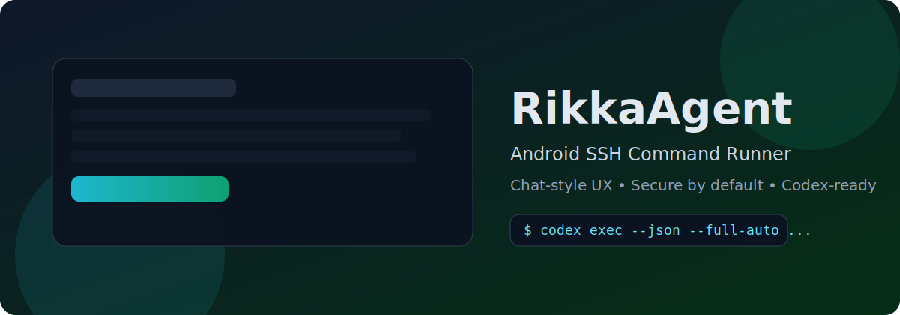

# RikkaAgent



> 📱 A polished Android SSH command runner with chat-style rendering for command outputs.

[](https://github.com/DeliciousBuding/RikkaAgent/actions/workflows/ci.yml)
[](LICENSE)
[](https://kotlinlang.org/)
[](app/build.gradle.kts)

Inspired by the UX feel of [RikkaHub](https://github.com/re-ovo/rikkahub), but implemented clean-room from scratch under Apache-2.0.

## ✨ Why RikkaAgent

Traditional mobile terminals work, but reading long outputs is painful. RikkaAgent focuses on readability, safety, and speed:

- 💬 Chat-style command and output timeline
- 🔐 Secure SSH with host-key verification and encrypted key storage
- 🧠 Codex mode for remote `codex exec --json --full-auto`
- 🧩 Markdown/code rendering optimized for streaming output

## 🚀 Feature Matrix

| Area | Status | Details |
|---|---|---|
| Core UI (Compose) | ✅ | Profiles, Editor, Session, Settings, Known Hosts, About |
| SSH Exec (Mode A) | ✅ | Real stdout/stderr/exit streaming via sshj |
| Authentication | ✅ | Password + private key + passphrase + PuTTY `.ppk` |
| Security | ✅ | TOFU host key verify, mismatch warning, encrypted key files |
| Codex Integration | ✅ | Profile toggle + workdir + API key + JSONL parse |
| Rendering | ✅ | Markdown + CodeCard + streaming-friendly behavior |
| i18n | ✅ | English + Chinese resources |
| CI | ✅ | test + lint + assemble + artifact uploads |
| Mermaid rendering | 🟡 | Planned |
| Expanded output tooling | 🟡 | Planned (`expand/download full output`) |

## 🧭 Product Scope

### In Scope

- Non-interactive SSH command execution (`exec` channel)
- Stream stdout/stderr into a chat conversation
- Copy/rerun/export workflows for daily ops usage

### Out of Scope

- PTY-style interactive terminal emulation (vim/top/tmux)
- Server-side HTTP command relay by default
- Fully autonomous command execution without explicit user intent

## 🏗️ Architecture

```text
:app            -> App shell, Navigation, ViewModels, Screens
:core:model     -> Domain models (profile, message, status)
:core:ssh       -> SSH runner, events, JSONL parsing, key helpers
:core:storage   -> Room/DataStore persistence
:core:ui        -> Reusable Compose UI components
```

### Mode A Data Flow

```text
User input -> ChatViewModel -> SshExecRunner.run(profile, command)
                                -> Flow<ExecEvent>
                                -> Stdout/Stderr/Exit/Error/Structured
                                -> Message updates
                                -> Compose UI render
```

## ⚙️ Quick Start

### Prerequisites

- JDK 17+
- Android SDK (API 35)
- Gradle 8.10.2 (wrapper included)

### Build / Test / Lint

```bash
./gradlew test
./gradlew :app:lintDevDebug
./gradlew assembleDevDebug
```

APK output:

- `app/build/outputs/apk/dev/debug/app-dev-debug.apk`

## 📊 Milestone Status

See [ROADMAP.md](ROADMAP.md) for the latest execution details.

| Milestone | Name | Status |
|---|---|---|
| M0 | Spec Freeze | ✅ Mostly complete |
| M1 | App Core UX | ✅ Mostly complete |
| M2 | Rendering Pipeline | ✅ Mostly complete |
| M3 | SSH Engine | ✅ Mostly complete |
| M4 | Codex Integration | ✅ Mostly complete |
| M5 | Release Quality | ✅ Mostly complete |

## 🔒 Security Notes

- Private keys are stored encrypted at rest (AndroidX Security Crypto)
- Host key mismatch is explicitly surfaced as a security warning
- This repo must not contain runtime secrets (keys/tokens/passwords)

Server hardening guidance: [docs/server-hardening.md](docs/server-hardening.md)

## 📚 Documentation

- [Spec Index](docs/spec/00-index.md)
- [Architecture](docs/architecture.md)
- [Threat Model](docs/threat-model.md)
- [Privacy Audit](docs/privacy-audit.md)
- [Release Checklist](docs/release-checklist.md)
- [RikkaHub UI Study (research)](docs/research/rikkahub-android-ui-study.md)

## 🤝 Contributing

Please read [CONTRIBUTING.md](CONTRIBUTING.md) and [CODE_OF_CONDUCT.md](CODE_OF_CONDUCT.md).

Security reports: [SECURITY.md](SECURITY.md)

## 📄 License

[Apache-2.0](LICENSE)
