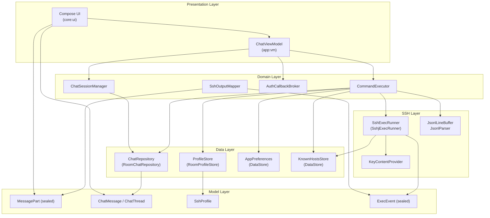
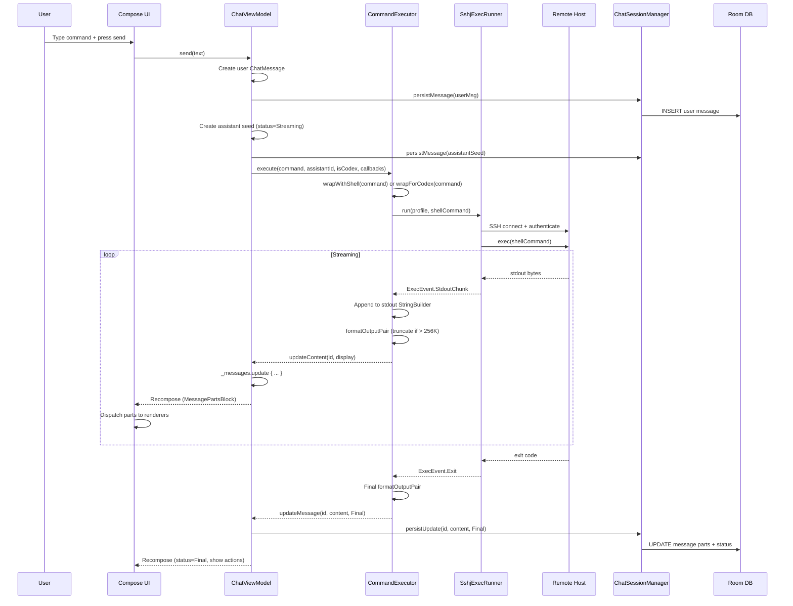
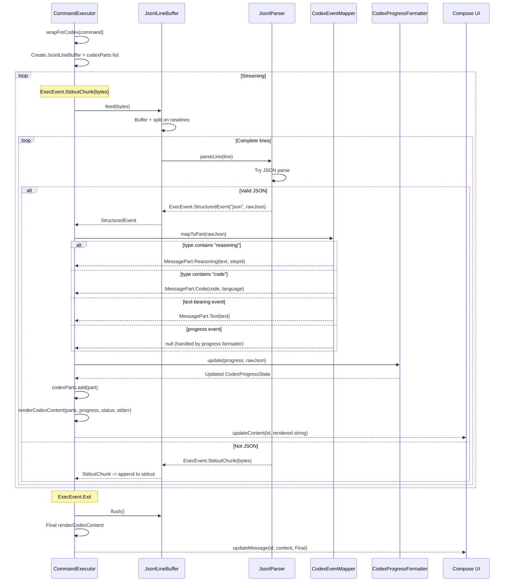
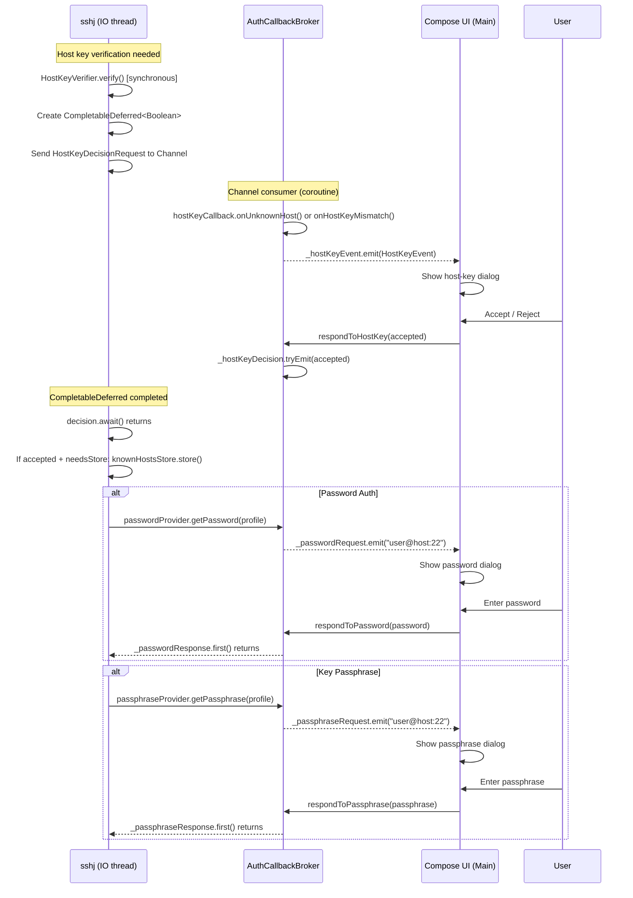
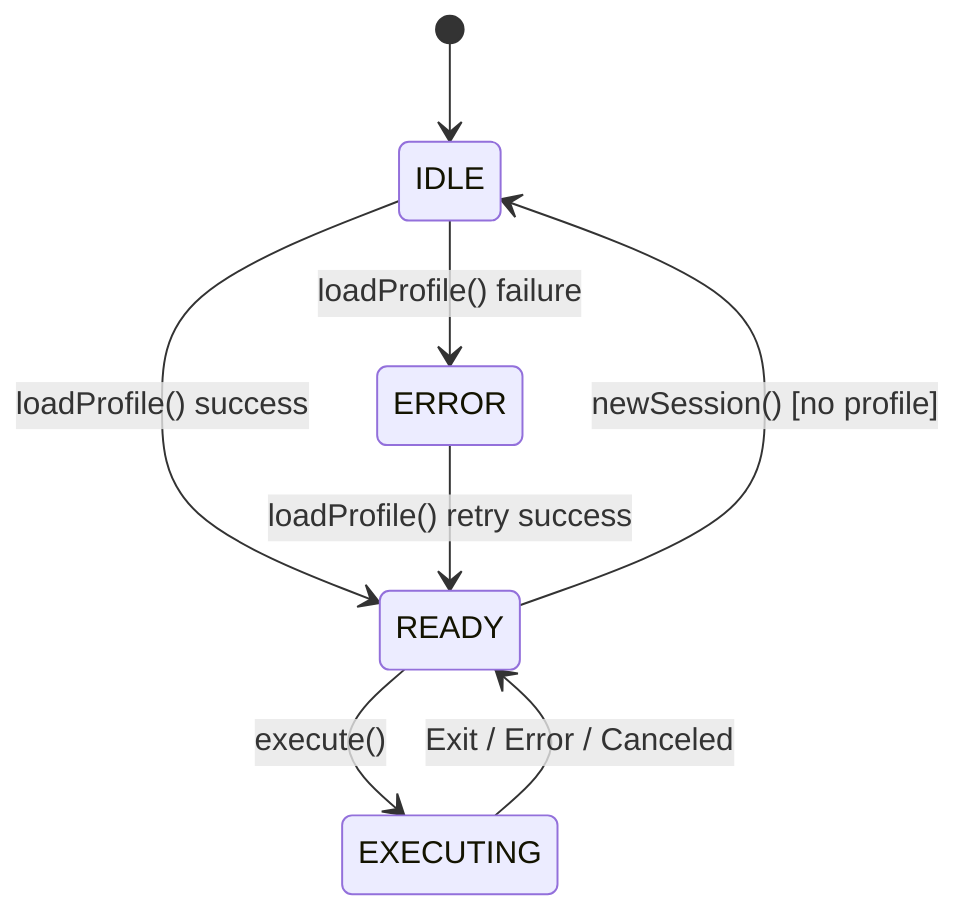

# RikkaAgent Architecture Document

> Last updated: 2026-06-23
> Status: Living document -- reflects current codebase state

---

## 1. Architecture Overview

### 1.1 System Architecture



### 1.2 Module Dependency Graph

```mermaid
graph LR
    app --> core:model
    app --> core:ui
    app --> core:ssh
    app --> core:storage
    core:ui --> core:model
    core:ssh --> core:model
    core:storage --> core:model
    core:ssh -.-> core:ui<br/>(indirect via callbacks)
```

Dependencies are strictly unidirectional: `core:*` modules never depend on each other; `app` is the sole convergence point.

### 1.3 Layered Architecture

| Layer | Module(s) | Responsibility |
|-------|-----------|----------------|
| **Presentation** | `core:ui`, `app` (Compose screens) | Render `ChatMessage` parts into Compose components; collect `StateFlow`/`SharedFlow` from ViewModel |
| **Domain / Orchestration** | `app:vm` (ChatViewModel, CommandExecutor, ChatSessionManager, AuthCallbackBroker) | Coordinate SSH execution lifecycle, thread management, auth callbacks; no Android framework dependency except `Application` for string resources |
| **Data** | `core:storage` (Room, DataStore) | Persist profiles, threads, messages, preferences; expose repository interfaces |
| **Infrastructure** | `core:ssh` (sshj) | SSH connection, exec, host-key verification, JSONL parsing |
| **Model** | `core:model` | Pure Kotlin data classes; zero Android dependencies; shared across all layers |

### 1.4 Technology Stack

| Category | Technology | Version | Purpose |
|----------|-----------|---------|---------|
| Language | Kotlin | 2.0+ | Primary language |
| UI | Jetpack Compose (Material 3) | Latest stable | Declarative UI |
| DI | Koin | 3.x | Dependency injection |
| Database | Room | 2.6+ | SQLite ORM for profiles, threads, messages |
| Preferences | DataStore (Preferences) | 1.0+ | Key-value settings |
| SSH | sshj | 0.38+ | SSH2 client (exec, key auth, host verification) |
| Serialization | kotlinx.serialization | 1.6+ | JSON polymorphism for MessagePart, JSONL parsing |
| Async | Kotlin Coroutines + Flow | 1.8+ | Structured concurrency, reactive state |
| Architecture | MVVM (ViewModel + StateFlow) | Lifecycle 2.8+ | State management |
| Build | Gradle (Kotlin DSL) + Typesafe Project Accessors | 8.x | Multi-module build |

---

## 2. Module Design

### 2.1 `:core:model` -- Domain Models

**Responsibility**: Pure Kotlin data classes shared across all layers. Zero Android dependencies.

**Public API**:

| Type | Description |
|------|-------------|
| `MessagePart` (sealed class) | Polymorphic message part with 8 subtypes: `Command`, `Stdout`, `Stderr`, `Reasoning`, `Code`, `Text`, `Error`, `Mermaid` |
| `ChatMessage` | Immutable message with `parts: List<MessagePart>`, backward-compatible `content` accessor, factory methods (`text()`, `command()`) |
| `ChatThread` | Thread metadata: `id`, `title`, `messages` |
| `ChatRole` | Enum: `User`, `Assistant` |
| `MessageStatus` | Enum: `Streaming`, `Final`, `Error`, `Canceled` |
| `SshProfile` | SSH connection config: host, port, auth, Codex settings, group, tags |
| `AuthType` | Enum: `PublicKey`, `Password` |
| `HostKeyPolicy` | Enum: `TrustFirstUse`, `RejectUnknown`, `AcceptAll` |
| `ProfileGroup` | Enum: `Development`, `Production`, `Testing`, `Personal`, `None` |

**Internal implementation**:
- `MessagePart` uses `@Serializable` + `@SerialName("type")` for polymorphic JSON
- `ChatMessage` keeps a deprecated `_content` field for backward-compatible deserialization; `parts` is the canonical representation
- `ChatMessage.migrateToParts()` extension handles explicit migration from legacy `content` to `parts`
- All data classes are immutable (`val` only) -- thread-safe by construction
- `ChatMessage.json` is a pre-configured `Json` instance with `classDiscriminator = "type"`, `ignoreUnknownKeys = true`, `isLenient = true`, `encodeDefaults = true`

**Dependencies**: `kotlinx-serialization-json` only

---

### 2.2 `:core:ui` -- Compose Components

**Responsibility**: Render `MessagePart` subtypes into Material 3 Compose components. No ViewModel or business logic.

**Public API**:

| Composable | Input | Description |
|------------|-------|-------------|
| `ChatBubble(message, ...)` | `ChatMessage` | Main chat bubble; dispatches parts to type-specific renderers |
| `MessagePartsBlock(message, ...)` | `ChatMessage` | Renders `parts` list; dispatches each `MessagePart` to its card |
| `ChainOfThought(steps, ...)` | `List<T>` | Timeline card for reasoning/tool-call steps; auto-collapse when count > threshold |
| `CommandCard(command, exitCode, isRunning)` | `String, Int?, Boolean` | Terminal-style command display with exit-code badge |
| `CodeCard(code, language)` | `String, String?` | Collapsible code block with syntax highlight and copy |
| `ReasoningCard(text, stepId, isStreaming)` | `String, String?, Boolean` | Collapsible chain-of-thought reasoning display |
| `StreamOutputCard(text, isStderr)` | `String, Boolean` | Stdout/stderr streaming output |
| `MermaidDiagramCard(source)` | `String` | Mermaid diagram rendering (optional feature gate) |
| `MarkdownText(markdown)` | `String` | Markdown-to-Compose renderer (headings, bold, code, tables) |
| `ErrorCard` / `MessagePartErrorCard` | Error details | Red-bordered error display |
| `ChatInput(...)` | Input state | Text input with send button |
| `ActionsSheet(...)` | Action callbacks | Bottom sheet with copy/rerun/share/delete |

**Internal implementation**:
- `MessagePartsBlock` is the central dispatcher: `when (part) { is MessagePart.Text -> ...; is MessagePart.Code -> ... }`
- `TextPartRenderer` heuristically detects markdown (`looksLikeMarkdown()`) and switches between `MarkdownText` and plain `Text`
- During streaming, `SelectionContainer` is skipped to avoid `ConcurrentModificationException` from rapid recomposition
- `ChainOfThought` uses `ChainOfThoughtScope` with both uncontrolled (`ChainOfThoughtStep`) and controlled (`ControlledChainOfThoughtStep`) step variants
- `ChatBubble` uses asymmetric rounded corners and role-based color theming (user = `primaryContainer`, assistant = `surface`, error = `errorContainer`, canceled = `surfaceVariant`)
- Theme system: `AppPreferences` exposes `theme`, `presetTheme`, `dynamicColor`, `chatFont`, `fontSizeRatio`, `bubbleOpacity` -- all consumed at the Compose root

**Dependencies**: `core:model`, Material 3, Lucide icons

---

### 2.3 `:core:ssh` -- SSH Execution

**Responsibility**: SSH connection management, command execution, output streaming, host-key verification, JSONL parsing.

**Public API**:

| Type | Kind | Description |
|------|------|-------------|
| `SshExecRunner` | interface | `fun run(profile, command): Flow<ExecEvent>` |
| `ClosableSshExecRunner` | interface | Extends `SshExecRunner` + `close()` |
| `SshExecRunnerFactory` | fun interface | `fun create(...): ClosableSshExecRunner` |
| `DefaultSshExecRunnerFactory` | object | Factory producing `SshjExecRunner` with `reuseConnections = true` |
| `ExecEvent` (sealed class) | data model | `StdoutChunk`, `StderrChunk`, `StructuredEvent`, `Exit`, `Canceled`, `Error` |
| `HostKeyCallback` | interface | `onUnknownHost(...)`, `onHostKeyMismatch(...)` |
| `KnownHostsStore` | interface | `getFingerprint`, `store`, `remove`, `getAll` |
| `StoredHostKey` | data class | Fingerprint + keyType + addedAtMs |
| `PasswordProvider` | fun interface | `suspend fun getPassword(profile): String` |
| `PassphraseProvider` | fun interface | `suspend fun getPassphrase(profile): String?` |
| `KeyContentProvider` | fun interface | `suspend fun getKeyContent(profile): String?` |
| `SshOutputMapper` | class | `fun map(execFlow, command): Flow<MessagePart>` -- transforms `ExecEvent` stream to structured parts |
| `JsonlParser` | object | Parses single JSONL line into `List<ExecEvent>` |
| `JsonlLineBuffer` | class | Accumulates byte chunks, splits into complete lines, delegates to `JsonlParser` |

**Internal implementation**:

*SshjExecRunner*:
- Uses `callbackFlow` to bridge sshj's blocking I/O to coroutine `Flow`
- Host-key verification bridges sshj's synchronous `HostKeyVerifier.verify()` to async `HostKeyCallback` via `Channel<HostKeyDecisionRequest>` + `CompletableDeferred<Boolean>` -- the only unavoidable `runBlocking` is on `CompletableDeferred.await()`, which is a pure signal-wait with no coroutine dispatching
- Known-host fingerprint is pre-loaded (suspend context) before the blocking `verify()` call to eliminate `runBlocking` for store reads
- Passphrase is pre-fetched (suspend context) before `PasswordFinder.reqPassword()` to eliminate `runBlocking` for provider calls
- stdout/stderr read concurrently on `Dispatchers.IO` via separate `launch` blocks
- Connection reuse: `reuseConnections = true` by default; cached by `"[host]:port:username"` key; stale connections evicted and retried once
- Private key format auto-detection: PuTTY vs OpenSSH via `detectPrivateKeyFormat()`

*SshOutputMapper*:
- Streaming boundary detection: code fence open/close, paragraph (`\n\n`), line (`\n`), size threshold (16K chars)
- ANSI escape stripping via regex (`\x1b\[...\]`, `\x1b]...\x07`)
- Emits: `Command` (initial) -> `Text`/`Code` (stdout) -> `Stderr` -> `Command` (final with exitCode) -> `Error`

*JsonlParser + JsonlLineBuffer*:
- Line-buffered: accumulates partial lines across byte chunks
- For each complete line: tries JSON parse -> `StructuredEvent`; falls back to `StdoutChunk`
- Best-effort extraction of `text/content/delta/message` -> `markdown_delta`; `status/stage/progress` -> `status`

**Dependencies**: `core:model`, sshj, kotlinx-serialization, kotlinx-coroutines

---

### 2.4 `:core:storage` -- Persistence

**Responsibility**: Room database for structured data, DataStore for key-value preferences.

**Public API**:

| Type | Kind | Description |
|------|------|-------------|
| `ChatRepository` | interface | `observeThreads`, `createThread`, `deleteThread`, `insertMessage`, `updateMessage`, `observeMessages`, `getMessages`, `updateThreadTitle` |
| `RoomChatRepository` | class | Room-backed implementation |
| `ProfileStore` | interface | `listProfiles`, `getById`, `upsert`, `delete` |
| `RoomProfileStore` | class | Room-backed implementation |
| `AppPreferences` | class | DataStore-backed: theme, dynamicColor, defaultShell, lastProfileId, enableMermaid, chatFont, fontSizeRatio, bubbleOpacity, etc. |

**Internal implementation**:

*Room Database* (`rikka_agent.db`, version 5):
- Entities: `SshProfileEntity`, `ChatThreadEntity`, `ChatMessageEntity`
- DAOs: `SshProfileDao`, `ChatMessageDao`
- TypeConverter: `MessagePartConverter` -- serializes `List<MessagePart>` to/from JSON string using `ChatMessage.json`
- `ChatMessageEntity` stores both `content` (text, for FTS/search) and `partsJson` (structured, for rendering)
- `RoomChatRepository.insertMessage()` uses `OnConflictStrategy.IGNORE` + fallback update to handle idempotent re-inserts

*Migrations*:
- `MIGRATION_4_5`: adds `partsJson` column; migrates existing `content` to `[{"type":"text","text":"..."}]`
- `fallbackToDestructiveMigration()` as safety net for development

*DataStore* (`settings`):
- Simple key-value pairs for user preferences
- All values exposed as `Flow<T>` for reactive collection

**Dependencies**: `core:model`, Room, DataStore, kotlinx-serialization

---

### 2.5 `:app` -- Application Shell

**Responsibility**: DI wiring, ViewModel, Activity/Fragment, navigation.

**Key components**:

| Component | Description |
|-----------|-------------|
| `AppModule` (Koin) | Provides: `AppDatabase`, DAOs, `ChatRepository`, `ProfileStore`, `AppPreferences`, `KnownHostsStore`, `KeyContentProvider`, `SshExecRunnerFactory` |
| `ChatViewModel` | Top-level ViewModel; thin coordination layer |
| `CommandExecutor` | SSH execution lifecycle management |
| `ChatSessionManager` | Thread CRUD, title auto-generation, message persistence |
| `AuthCallbackBroker` | Bridges SSH auth callbacks to UI SharedFlows |

**Internal file layout**:
```
app/src/main/java/io/rikka/agent/
  di/
    AppModule.kt               -- Koin module definitions
  vm/
    ChatViewModel.kt           -- Top-level ViewModel (thin orchestrator)
    CommandExecutor.kt         -- SSH exec lifecycle + CodexEventMapper + OutputFormatter
    ChatSessionManager.kt      -- Thread CRUD + auto-title + persistence
    AuthCallbackBroker.kt      -- Sync SSH callbacks -> async UI SharedFlows
```

---

## 3. Data Flow Design

### 3.1 User Input -> SSH Exec -> MessagePart -> UI Rendering



### 3.2 Codex JSONL -> MessagePart -> ChainOfThought



**Rendering pipeline**:
1. `CodexEventMapper.mapToPart()` maps raw JSON -> `MessagePart.Reasoning` / `.Code` / `.Text`
2. `renderCodexContent()` assembles: progress header (status + thread/turn/item) + body
3. `renderParts()` renders each part: Reasoning -> collapsible `<details>`, Code -> fenced block, Text -> as-is
4. Flat string is stored in `ChatMessage.content`; structured parts are passed via `updateParts` callback

### 3.3 Authentication Callback Flow



**Key design**: All auth flows use `MutableSharedFlow(extraBufferCapacity = 1)` for both request and response, ensuring emit never suspends (preventing deadlock between SSH thread and UI thread). The request/response pattern is inherently sequential -- SSH thread emits request, suspends on response flow, resumes only when UI emits response.

---

## 4. Key Design Decisions

### 4.1 MessagePart sealed class vs UIMessage

| | Options Considered |
|---|---|
| **Background** | Need a model that represents both SSH I/O (command, stdout, stderr) and AI reasoning (reasoning, code) in a single message. |
| **Option A** | Monolithic `UIMessage` with `content: String` + optional metadata fields |
| **Option B** | `MessagePart` sealed class with typed subtypes |
| **Decision** | **Option B: MessagePart sealed class** |
| **Rationale** | SSH-native types (Command, Stdout, Stderr) and AI types (Reasoning, Code) are fundamentally different. A sealed class lets each subtype carry its own semantics (e.g., `Command.exitCode`, `Code.language`, `Reasoning.stepId`) without nullable fields or metadata bags. The `when` exhaustive check in `MessagePartsBlock` ensures new subtypes produce compile errors at all render sites. |
| **Trade-off** | Slightly more complex serialization (polymorphic JSON with `type` discriminator), mitigated by kotlinx.serialization sealed-class support. Legacy `content: String` is kept as a deprecated private field with a backward-compatible accessor. |

### 4.2 ViewModel Split Strategy

| | Options Considered |
|---|---|
| **Background** | `ChatViewModel` initially handled everything: SSH execution, thread management, auth callbacks, UI state. |
| **Option A** | Single monolithic ViewModel |
| **Option B** | Split into `ChatViewModel` (coordinator) + `CommandExecutor` + `ChatSessionManager` + `AuthCallbackBroker` |
| **Decision** | **Option B: 3 sub-components + 1 broker** |
| **Rationale** | Each sub-component has a distinct responsibility and lifecycle: `CommandExecutor` owns SSH connection state and execution; `ChatSessionManager` owns thread CRUD and persistence; `AuthCallbackBroker` bridges sync/async boundaries. `ChatViewModel` becomes a thin coordinator that wires them together and exposes unified state to the UI. This makes each component independently testable. |
| **Trade-off** | More classes to manage; requires careful coordination (e.g., `cancelRunning()` must touch both `CommandExecutor` and `ChatSessionManager`). The coordination complexity is acceptable given the testability gains. |

### 4.3 SSH Exec vs PTY

| | Options Considered |
|---|---|
| **Background** | SSH supports two execution modes: exec (non-interactive command execution) and PTY (pseudo-terminal for interactive sessions). |
| **Option A** | PTY mode (full terminal emulation) |
| **Option B** | Exec mode (command in, stdout/stderr out) |
| **Decision** | **Option B: Exec mode only (v1)** |
| **Rationale** | RikkaAgent's primary use case is running remote commands and collecting structured output. Exec mode gives clean stdout/stderr separation, no terminal escape sequence handling overhead, and natural exit-code semantics. PTY mode would require terminal emulation, input forwarding, and complicates output parsing. The `SshExecRunner` interface is intentionally small (`run(profile, command): Flow<ExecEvent>`) so a PTY runner can be added later without touching UI code. |
| **Trade-off** | No interactive programs (vim, top, htmx). Acceptable for v1; PTY support is tracked separately. |

### 4.4 Room Migration Strategy

| | Options Considered |
|---|---|
| **Background** | Adding `partsJson` column to `chat_messages` table (v4 -> v5). |
| **Option A** | Destructive migration (drop + recreate) |
| **Option B** | Manual SQL migration with data preservation |
| **Option C** | Both: manual migration + destructive fallback |
| **Decision** | **Option C: Manual migration with destructive fallback** |
| **Rationale** | `MIGRATION_4_5` preserves existing chat history by migrating `content` to `partsJson` via SQL `UPDATE`. The `fallbackToDestructiveMigration()` in `AppDatabase` builder acts as a safety net for development -- if a migration is missing, the database is recreated rather than crashing. In production, manual migrations should always be provided. |
| **Trade-off** | `fallbackToDestructiveMigration()` is dangerous in production (data loss). The current approach is acceptable for a development-stage app; production releases should remove the fallback or add a data-loss warning. |

### 4.5 Theme System Alignment

| | Options Considered |
|---|---|
| **Background** | RikkaAgent supports multiple theme presets (sakura, etc.), dynamic color, custom fonts, and per-component opacity. |
| **Option A** | Custom theme engine with XML resources |
| **Option B** | Material 3 dynamic color + DataStore preferences |
| **Decision** | **Option B: Material 3 + DataStore** |
| **Rationale** | Material 3's `dynamicColor` API provides system-level theming (wallpaper-based on Android 12+). `AppPreferences` stores overrides: `presetTheme`, `chatFont`, `fontSizeRatio`, `bubbleOpacity`. All values are `Flow<T>` collected at the Compose root, driving recomposition. No custom theme engine needed. |
| **Trade-off** | Limited to Material 3's color system. Custom presets require manual color token definition. Acceptable given the consistency benefits. |

---

## 5. Interface Contracts

### 5.1 `SshExecRunner`

```kotlin
/**
 * Executes a command on a remote host via SSH and streams output events.
 *
 * Implementations must:
 * - Emit [ExecEvent.StdoutChunk] for each stdout byte chunk received
 * - Emit [ExecEvent.StderrChunk] for each stderr byte chunk received
 * - Emit [ExecEvent.Exit] exactly once when the command finishes
 * - Emit [ExecEvent.Error] on connection/auth failures (instead of throwing)
 * - Emit [ExecEvent.Canceled] if the coroutine is canceled
 * - Close the flow channel after emitting a terminal event
 *
 * Thread safety: The returned Flow is cold; each collection creates an independent execution.
 */
interface SshExecRunner {
    fun run(profile: SshProfile, command: String): Flow<ExecEvent>
}
```

### 5.2 `HostKeyCallback`

```kotlin
/**
 * Callback for SSH host key verification decisions.
 *
 * Called synchronously from sshj's HostKeyVerifier.verify() on the IO thread.
 * Implementations must bridge to an async UI flow (see AuthCallbackBroker).
 *
 * @return true to trust/accept the key, false to reject and abort connection.
 */
interface HostKeyCallback {
    suspend fun onUnknownHost(
        host: String, port: Int, fingerprint: String, keyType: String
    ): Boolean

    suspend fun onHostKeyMismatch(
        host: String, port: Int,
        expectedFingerprint: String, actualFingerprint: String, keyType: String
    ): Boolean
}
```

### 5.3 `KnownHostsStore`

```kotlin
/**
 * Persistent store for SSH known-host fingerprints.
 *
 * Keyed by host:port to avoid mismatch bugs (per SSH spec).
 * Implementations must be thread-safe for concurrent read/write.
 */
interface KnownHostsStore {
    suspend fun getFingerprint(host: String, port: Int): StoredHostKey?
    suspend fun store(host: String, port: Int, key: StoredHostKey)
    suspend fun remove(host: String, port: Int)
    suspend fun getAll(): List<Pair<String, StoredHostKey>>
}
```

### 5.4 `ChatRepository`

```kotlin
/**
 * Repository for chat thread and message persistence.
 *
 * All methods are thread-safe (Room DAO operations run on the Room query executor).
 * Flow-based methods emit on the Room invalidation tracker.
 */
interface ChatRepository {
    fun observeThreads(profileId: String): Flow<List<ChatThread>>
    suspend fun createThread(profileId: String, title: String): String
    suspend fun deleteThread(threadId: String)
    suspend fun insertMessage(threadId: String, message: ChatMessage)
    suspend fun updateMessage(id: String, parts: List<MessagePart>, status: MessageStatus)
    fun observeMessages(threadId: String): Flow<List<ChatMessage>>
    suspend fun getMessages(threadId: String): List<ChatMessage>
    suspend fun updateThreadTitle(threadId: String, title: String)
}
```

### 5.5 `ProfileStore`

```kotlin
/**
 * Storage interface for SSH connection profiles.
 *
 * Implementations must handle concurrent access safely.
 */
interface ProfileStore {
    suspend fun listProfiles(): List<SshProfile>
    suspend fun getById(id: String): SshProfile?
    suspend fun upsert(profile: SshProfile)
    suspend fun delete(profileId: String)
}
```

### 5.6 `MessagePart` (sealed class)

```kotlin
/**
 * Polymorphic message part. A ChatMessage carries an ordered list of parts
 * instead of a monolithic content string.
 *
 * Subtypes:
 * - SSH:      Command(command, exitCode?, startedAtEpochMs?), Stdout(text), Stderr(text)
 * - AI:       Reasoning(text, stepId?), Code(code, language?)
 * - General:  Text(text), Error(message, cause?, code?), Mermaid(definition, caption?)
 *
 * All subtypes are immutable data classes -- thread-safe by construction.
 * Serialized via kotlinx.serialization with @SerialName("type") discriminator.
 */
@Serializable
sealed class MessagePart { ... }
```

### 5.7 `ChatMessage`

```kotlin
/**
 * Immutable chat message with structured parts.
 *
 * Backward compatibility: keeps deprecated _content field; content accessor
 * returns _content if non-empty, otherwise concatenates Text parts.
 *
 * Factory methods:
 * - ChatMessage.text(id, role, text) -- simple text message
 * - ChatMessage.command(id, command, stdout, stderr, exitCode) -- command with output
 */
@Serializable
data class ChatMessage(
    val id: String,
    val role: ChatRole,
    val parts: List<MessagePart> = emptyList(),
    val timestampMs: Long,
    val status: MessageStatus = MessageStatus.Final,
    @Deprecated("Use parts") @SerialName("content") private val _content: String = "",
) {
    val content: String get() = _content.ifEmpty { textContent }
    val textContent: String get() = parts.filterIsInstance<MessagePart.Text>().joinToString("\n") { it.text }
    val commands: List<MessagePart.Command> get() = parts.filterIsInstance<MessagePart.Command>()
    val lastCommand: MessagePart.Command? get() = commands.lastOrNull()
    val stdoutText: String get() = parts.filterIsInstance<MessagePart.Stdout>().joinToString("") { it.text }
    val stderrText: String get() = parts.filterIsInstance<MessagePart.Stderr>().joinToString("") { it.text }

    companion object {
        val json: Json = Json {
            classDiscriminator = "type"
            ignoreUnknownKeys = true
            isLenient = true
            encodeDefaults = true
        }
        fun text(id, role, text, timestampMs, status): ChatMessage
        fun command(id, command, stdout, stderr, exitCode, timestampMs): ChatMessage
    }
}
```

### 5.8 `ExecEvent` (sealed class)

```kotlin
/**
 * Events emitted by an SSH exec runner during command execution.
 *
 * Lifecycle: StdoutChunk/StderrChunk* -> Exit | Error | Canceled
 * StructuredEvent is emitted inline with StdoutChunk for Codex JSONL mode.
 */
@Serializable
sealed class ExecEvent {
    data class StdoutChunk(val bytes: ByteArray) : ExecEvent()
    data class StderrChunk(val bytes: ByteArray) : ExecEvent()
    data class StructuredEvent(val kind: String, val rawJson: String) : ExecEvent()
    data class Exit(val code: Int?) : ExecEvent()
    data object Canceled : ExecEvent()
    data class Error(val category: String, val message: String) : ExecEvent()
}
```

### 5.9 Auth Providers

```kotlin
/**
 * Provides passwords for SSH authentication.
 * UI layer implements this (typically prompting the user).
 */
fun interface PasswordProvider {
    suspend fun getPassword(profile: SshProfile): String
}

/**
 * Provides private key content for SSH authentication.
 * Returns the PEM-encoded key content as a String, or null if unavailable.
 */
fun interface KeyContentProvider {
    suspend fun getKeyContent(profile: SshProfile): String?
}

/**
 * Provides passphrase for encrypted private keys.
 * Returns null if the user cancels.
 */
fun interface PassphraseProvider {
    suspend fun getPassphrase(profile: SshProfile): String?
}
```

---

## 6. Security Architecture

### 6.1 Key Storage

| Asset | Storage Mechanism | Notes |
|-------|------------------|-------|
| SSH private key content | `ContentUriKeyContentProvider` via Android SAF (Storage Access Framework) | Keys are not stored in the app's data directory; the app holds a content URI reference. Key content is read on-demand via `ContentResolver.openInputStream()`. |
| SSH profile credentials | Room database (`rikka_agent.db`) | Profile stores `keyRef` (content URI or path), not the key itself. Password/passphrase are never persisted -- they are requested interactively via `AuthCallbackBroker` and held only in memory for the duration of the session. |
| Known-host fingerprints | DataStore (`DataStoreKnownHostsStore`) | Fingerprints are stored as plaintext strings. Not sensitive (they are public information), but integrity matters. |
| User preferences | DataStore (`settings`) | No sensitive data stored. |

**Gap**: The current implementation does not use `EncryptedFile` or `AndroidKeyStore` for Room database encryption. If the device is rooted, the database is readable. For production hardening, consider SQLCipher or Jetpack Security `EncryptedFile`.

### 6.2 Host Key Verification

Three policies defined in `HostKeyPolicy`:

| Policy | Behavior | Security Level |
|--------|----------|---------------|
| `TrustFirstUse` (default) | First connection: prompt user via `HostKeyEvent.UnknownHost`; save fingerprint on accept. Subsequent connections: verify against stored key; mismatch -> prompt via `HostKeyEvent.Mismatch`. | Medium -- TOFU model (same as OpenSSH) |
| `RejectUnknown` | Only connect if host key is already in known-hosts. Unknown hosts -> connection refused. | High -- requires pre-distribution of host keys |
| `AcceptAll` | Accept any host key without verification. | None -- vulnerable to MITM |

**Mismatch handling**: When `TrustFirstUse` detects a mismatch, the user is prompted with both expected and actual fingerprints. If rejected, `SshHostKeyRejectedException` is thrown and surfaced as `ExecEvent.Error("host_key_rejected", ...)`. The connection is aborted.

**Implementation detail**: `verify()` is sshj's synchronous callback, bridged to async UI via `CompletableDeferred<Boolean>` + `Channel<HostKeyDecisionRequest>`. The only `runBlocking` call is on `CompletableDeferred.await()` -- a pure signal-wait with no coroutine dispatching, so it cannot deadlock.

### 6.3 Command Injection Prevention

- Commands are passed as a single string to `session.exec(command)` -- sshj sends them as-is to the remote shell
- No local shell interpolation occurs (the app does not invoke `/bin/sh -c` locally)
- The remote shell handles command parsing; the app does not construct shell pipelines from user input
- `CommandComposer.wrapWithShell()` wraps user commands with the configured shell (e.g., `/bin/bash -c 'command'`), quoting the command in single quotes
- `CommandComposer.wrapForCodex()` constructs the Codex invocation with proper quoting

**Risk**: If the user's command contains single quotes, the wrapping could break. The current implementation uses simple string concatenation rather than proper shell escaping. This is acceptable because the user is intentionally executing arbitrary commands on their own server.

### 6.4 Log Sanitization

- `Log.e("ChatViewModel", ...)` is used for error logging; no user commands or credentials are logged
- SSH connection errors use `ErrorMessageMapper.friendlyErrorMessage()` which maps raw exception messages to user-friendly strings, stripping internal details
- `ExecEvent.Error` carries a `category` (e.g., "auth_failed", "timeout") rather than raw exception messages
- No password/passphrase values appear in any log output

---

## 7. Testability Design

### 7.1 Layer-Specific Test Strategy

| Layer | Test Type | Strategy |
|-------|-----------|----------|
| **Model** | Unit test | Pure data classes; test serialization round-trips, backward-compatible deserialization, `migrateToParts()`, factory methods |
| **Storage** | Unit test + Integration test | `ChatRepository` / `ProfileStore` tested with in-memory Room database; `AppPreferences` tested with in-memory DataStore |
| **SSH** | Unit test + Integration test | `SshExecRunner` tested with mock SSH server (Apache SSHD or sshj test harness); `SshOutputMapper` tested with synthetic `ExecEvent` flows; `JsonlParser` tested with JSONL fixtures |
| **VM** | Unit test | `ChatViewModel` / `CommandExecutor` / `ChatSessionManager` tested with fake implementations of all dependencies; `AuthCallbackBroker` tested with coroutine test scope |
| **UI** | Screenshot test + Compose test | `ChatBubble`, `MessagePartsBlock`, `ChainOfThought` tested with Compose testing APIs; screenshot tests for visual regression |

### 7.2 Mock/Fake Design

| Interface | Fake Implementation | Purpose |
|-----------|-------------------|---------|
| `SshExecRunner` | `FakeSshExecRunner` | Returns pre-defined `ExecEvent` sequences; configurable delay and error injection |
| `ChatRepository` | `InMemoryChatRepository` | In-memory `MutableMap` backing; no Room dependency |
| `ProfileStore` | `InMemoryProfileStore` | In-memory `MutableMap` backing |
| `KnownHostsStore` | `InMemoryKnownHostsStore` | Already exists in codebase; in-memory map |
| `HostKeyCallback` | `FakeHostKeyCallback` | Always accepts or rejects based on configuration |
| `PasswordProvider` | `FakePasswordProvider` | Returns pre-configured password |
| `KeyContentProvider` | `FakeKeyContentProvider` | Returns pre-configured key content |
| `SshExecRunnerFactory` | `FakeSshExecRunnerFactory` | Returns `FakeSshExecRunner` |

### 7.3 Integration Test Scenarios

| Scenario | Components | Approach |
|----------|------------|----------|
| **Full command lifecycle** | ViewModel + CommandExecutor + FakeSshExecRunner + InMemoryChatRepository | Send command -> verify message creation -> verify streaming updates -> verify final state -> verify persistence |
| **Thread switching** | ViewModel + ChatSessionManager + InMemoryChatRepository | Create multiple threads -> switch -> verify message isolation -> delete active thread -> verify new session |
| **Auth callback round-trip** | AuthCallbackBroker + coroutine test scope | Emit host-key event -> respond -> verify decision propagated |
| **Codex JSONL parsing** | JsonlLineBuffer + JsonlParser + CodexEventMapper | Feed JSONL fixtures -> verify MessagePart extraction -> verify progress state updates |
| **Room migration** | Room in-memory + Migration_4_5 | Create v4 schema with data -> migrate -> verify partsJson populated -> verify content preserved |
| **Output truncation** | OutputFormatter | Feed > 256K chars -> verify truncation hint -> verify full output stored separately |

### 7.4 Test Dependencies

```kotlin
// Unit tests
testImplementation("org.jetbrains.kotlinx:kotlinx-coroutines-test")
testImplementation("app.cash.turbine:turbine")  // Flow testing
testImplementation("io.mockk:mockk")

// Integration tests
androidTestImplementation("androidx.room:room-testing")
androidTestImplementation("androidx.compose.ui:ui-test-junit4")

// SSH integration tests
testImplementation("org.apache.sshd:sshd-core")  // Mock SSH server
```

---

## Appendix A: Module File Inventory

### `:core:model`
```
core/model/src/main/kotlin/io/rikka/agent/model/
  MessagePart.kt       -- sealed class with 8 subtypes
  ChatModels.kt        -- ChatMessage, ChatThread, ChatRole, MessageStatus
  SshProfile.kt        -- SshProfile, AuthType, HostKeyPolicy, ProfileGroup
```

### `:core:ssh`
```
core/ssh/src/main/kotlin/io/rikka/agent/ssh/
  SshInterfaces.kt         -- SshExecRunner, ExecEvent (sealed)
  SshExecRunnerFactory.kt  -- ClosableSshExecRunner, SshExecRunnerFactory, DefaultSshExecRunnerFactory
  SshjExecRunner.kt        -- SshjExecRunner (sshj-backed), PasswordProvider, PassphraseProvider, KeyContentProvider
  SshOutputMapper.kt       -- SshOutputMapper (ExecEvent -> MessagePart)
  SshConnectionPool.kt     -- Connection pooling utilities
  SshKeyGenerator.kt       -- Key generation utilities
  JsonlParser.kt           -- JsonlParser, JsonlLineBuffer
  KnownHostsStore.kt       -- KnownHostsStore, HostKeyCallback, StoredHostKey
  InMemoryKnownHostsStore.kt -- Test fake
```

### `:core:storage`
```
core/storage/src/main/kotlin/io/rikka/agent/storage/
  ChatRepository.kt    -- ChatRepository interface, RoomChatRepository
  ProfileStore.kt      -- ProfileStore interface
  RoomProfileStore.kt  -- Room-backed ProfileStore
  AppPreferences.kt    -- DataStore-backed preferences
  db/
    AppDatabase.kt         -- Room database (version 5)
    ChatEntities.kt        -- ChatThreadEntity, ChatMessageEntity
    SshProfileEntity.kt    -- SshProfileEntity
    SshProfileDao.kt       -- DAO for profiles
    ChatMessageDao.kt      -- DAO for threads + messages
    MessagePartConverter.kt -- Room TypeConverter for List<MessagePart>
    Migrations.kt          -- MIGRATION_4_5
    Mappers.kt             -- Entity <-> Model mappers
```

### `:core:ui`
```
core/ui/src/main/kotlin/io/rikka/agent/ui/components/
  ChatBubble.kt          -- Main chat bubble (user + assistant)
  MessagePartsBlock.kt   -- Part-type dispatcher
  ChainOfThought.kt      -- Timeline reasoning card
  CommandCard.kt         -- Terminal-style command display
  CodeCard.kt            -- Collapsible code block
  ReasoningCard.kt       -- Collapsible reasoning display
  StreamOutputCard.kt    -- Stdout/stderr display
  MermaidDiagramCard.kt  -- Mermaid diagram rendering
  MermaidSupport.kt      -- Mermaid utilities
  MarkdownText.kt        -- Markdown renderer
  MarkdownBlock.kt       -- Markdown block renderer
  HighlightCodeBlock.kt  -- Syntax-highlighted code
  ErrorCard.kt           -- Error display
  MessagePartErrorCard.kt -- Structured error display
  ChatAvatar.kt          -- User/assistant avatars
  ChatInput.kt           -- Text input component
  ActionsSheet.kt        -- Bottom action sheet
  DataTable.kt           -- Table rendering
  DotLoading.kt          -- Loading animation
  Form.kt                -- Form components
  Tag.kt                 -- Tag/chip component
```

### `:app`
```
app/src/main/java/io/rikka/agent/
  di/
    AppModule.kt           -- Koin module definitions
  vm/
    ChatViewModel.kt       -- Top-level ViewModel
    CommandExecutor.kt     -- SSH execution lifecycle + CodexEventMapper
    ChatSessionManager.kt  -- Thread CRUD + persistence
    AuthCallbackBroker.kt  -- Auth callback bridge
```

---

## Appendix B: State Machine -- ConnectionState



---

## Appendix C: MessagePart Type Dispatch Matrix

| MessagePart subtype | Primary renderer | Secondary | Codex mode | Plain mode |
|---------------------|-----------------|-----------|------------|------------|
| `Text` | `MarkdownText` or plain `Text` | -- | Yes (from JSONL text events) | Yes (stdout content) |
| `Code` | `CodeCard` | Syntax highlight, copy | Yes (from JSONL code events) | Yes (detected code fences) |
| `Reasoning` | `ReasoningCard` | Collapsible CoT | Yes (from JSONL reasoning events) | No |
| `Command` | `CommandCard` | Exit code badge | No | Yes (initial + final) |
| `Stdout` | `StreamOutputCard` | -- | No | Yes (raw stdout) |
| `Stderr` | `StreamOutputCard` (stderr style) | Red/orange tint | Yes (appended at end) | Yes |
| `Error` | `MessagePartErrorCard` | Red border, error icon | Yes (on failure) | Yes (on failure) |
| `Mermaid` | `MermaidDiagramCard` | Feature-gated | Possible | Possible |

---

## Appendix D: Transformer Pipeline

```
Raw bytes (ByteArray)
  -> ExecEvent (StdoutChunk/StderrChunk/Exit/Error)
  -> JsonlLineBuffer -> ExecEvent (StructuredEvent/StdoutChunk)
  -> CodexEventMapper -> MessagePart (Reasoning/Code/Text)
  -> OutputFormatter/CodexProgressFormatter -> String (flat markdown)
  -> ChatMessage (parts: List<MessagePart>)
  -> Room Entity (partsJson: String)
```

**Design principle**: Each layer does one thing. `JsonlLineBuffer` only splits lines. `JsonlParser` only parses JSON. `CodexEventMapper` only maps types. The `MessagePart` list is the structured intermediate representation; flat string rendering is an optional downstream consumer.
