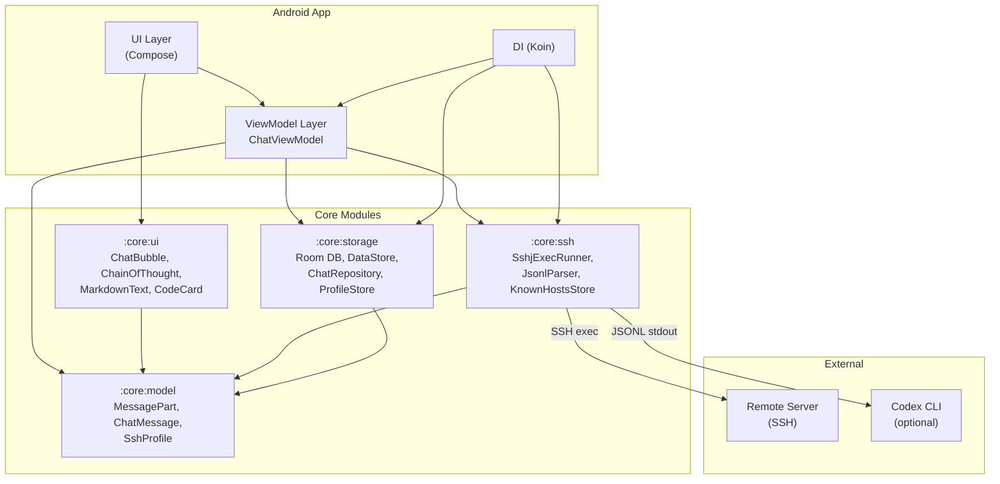
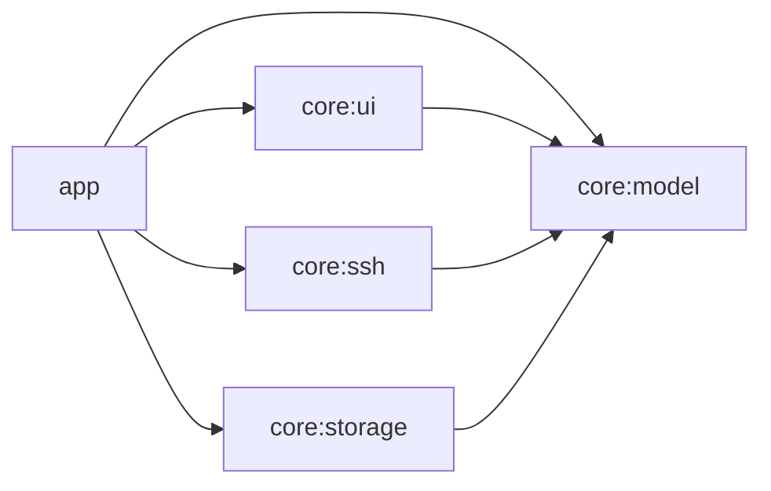
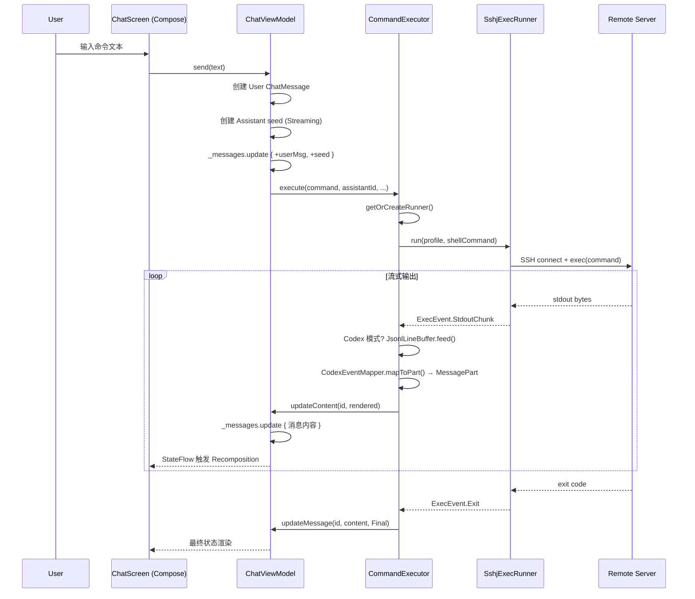
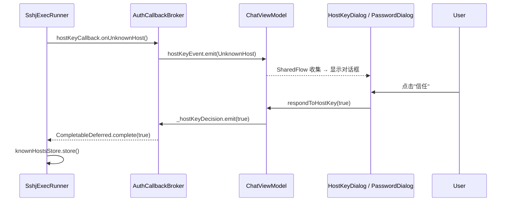
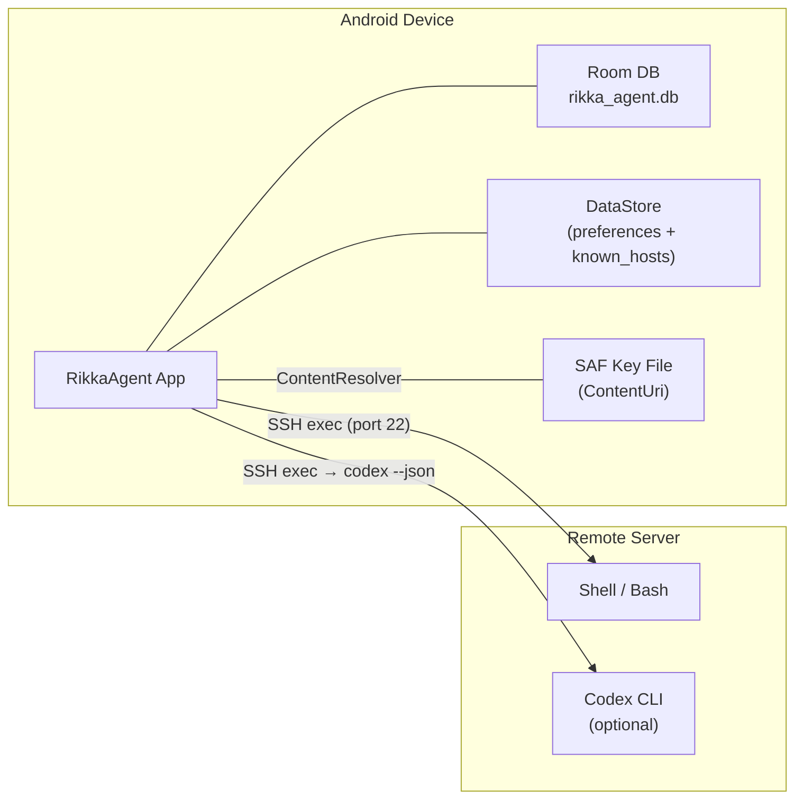
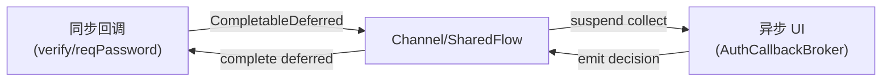

# RikkaAgent Architecture

RikkaAgent 是一个 Android SSH 命令执行器（command executor），通过 SSH exec 通道连接远程服务器执行命令，并以聊天消息形式呈现输出。本文档描述其模块化架构、数据流、关键设计决策与安全模型。

---

## 1. System Architecture



### 1.1 Module Dependency Graph



依赖方向严格单向：`core:*` 模块之间不互相依赖，`app` 模块是唯一汇聚点。

---

## 2. Module Responsibilities

| Module | Path | Responsibility |
|--------|------|----------------|
| `:app` | `app/` | Android 应用入口、DI 配置、ViewModel、导航、屏幕实现 |
| `:core:model` | `core/model/` | 纯 Kotlin 数据模型，零 Android 依赖：`MessagePart`、`ChatMessage`、`SshProfile` |
| `:core:ui` | `core/ui/` | 可复用 Compose 组件：`ChatBubble`、`ChainOfThought`、`CodeCard`、`MarkdownText`、`AnsiStripper` |
| `:core:ssh` | `core/ssh/` | SSH 执行引擎：`SshjExecRunner`、`JsonlParser`、`KnownHostsStore` 接口、`SshExecRunnerFactory` |
| `:core:storage` | `core/storage/` | 持久化层：Room 数据库、DataStore 偏好、`ChatRepository`、`ProfileStore` 接口与实现 |

### 2.1 `:app` 内部职责划分

```
app/src/main/java/io/rikka/agent/
├── di/                    # Koin 模块定义
│   ├── AppModule.kt       # 单例：DB、Repository、SSH 基础设施
│   └── ViewModelModule.kt # ViewModel 注入
├── vm/                    # ViewModel 与领域逻辑
│   ├── ChatViewModel.kt       # 薄编排器：组合子组件
│   ├── ChatSessionManager.kt  # 线程生命周期：CRUD、自动标题
│   ├── CommandExecutor.kt     # SSH 执行生命周期：连接、流式输出、取消
│   ├── AuthCallbackBroker.kt  # 同步 SSH 回调 → 异步 UI Flow 桥接
│   ├── CommandComposer.kt     # Shell/Codex 命令包装
│   ├── CodexProgressFormatter # Codex 进度状态解析
│   ├── OutputFormatter.kt     # stdout/stderr 格式化与截断
│   └── ErrorMessageMapper.kt  # SSH 错误 → 用户友好消息
├── ui/screen/             # 屏幕级 Composable
├── nav/                   # Navigation Host 定义
└── ssh/                   # Android 特定 SSH 实现
    ├── DataStoreKnownHostsStore.kt
    └── ContentUriKeyContentProvider.kt
```

---

## 3. Data Flow

### 3.1 用户输入 → SSH exec → MessagePart → UI 渲染



### 3.2 Codex JSONL 管线

```
SSH stdout bytes
  → JsonlLineBuffer.feed(bytes)        # 按行分割，处理跨 chunk 边界
  → JsonlParser.parseLine(line)        # JSON? → StructuredEvent : StdoutChunk
  → CodexEventMapper.mapToPart(json)   # JSON → MessagePart (Reasoning/Code/Text)
  → CodexProgressFormatter.update()    # 进度状态 (thread/turn/item)
  → renderCodexContent()               # MessagePart[] → flat markdown string
  → updateContent() / updateParts()    # 推送到 UI
```

### 3.3 认证回调流



---

## 4. Key Design Decisions

### 4.1 MessagePart Sealed Class

**设计动机**：需要在单条消息中混合表达多种内容类型（命令、stdout、AI 推理、代码块、Mermaid 图），同时保持序列化兼容性。

**选择 sealed class 而非 sealed interface 的理由**：
- kotlinx.serialization 对 sealed class 的多态序列化支持成熟，`@SerialName` 提供稳定的 JSON discriminator
- 所有子类型共享同一序列化配置（`classDiscriminator = "type"`），无需额外 `@Polymorphic` 注解

**子类型分类**：

| 类别 | 子类型 | 用途 |
|------|--------|------|
| SSH 原生 | `Command`, `Stdout`, `Stderr` | SSH exec 输出的一等公民 |
| AI/Codex | `Reasoning`, `Code` | Codex JSONL 事件映射 |
| 通用 | `Text`, `Error`, `Mermaid` | 人类可读内容、错误、图表 |

**向后兼容策略**：`ChatMessage` 保留 `_content` 字段（`@Deprecated`），反序列化时若 `parts` 为空则自动迁移为 `listOf(Text(content))`。`migrateToParts()` 扩展函数用于显式迁移（如 Room migration）。

**扩展方式**：新增子类型只需添加 `@Serializable @SerialName("new_type") data class`，不影响现有反序列化。

### 4.2 ViewModel 拆分策略

`ChatViewModel` 被有意设计为**薄编排器**，不包含业务逻辑：

```
ChatViewModel
  ├── ChatSessionManager    # 线程 CRUD、自动标题、消息持久化
  ├── CommandExecutor        # SSH 执行生命周期、输出格式化、Codex 管线
  └── AuthCallbackBroker     # 同步 SSH 回调 → 异步 UI 桥接
```

**拆分理由**：
1. **单一职责**：每个子组件可独立测试（见 `ChatViewModelTest`、`CommandComposerTest`）
2. **生命周期分离**：`CommandExecutor` 管理 SSH 连接（需 `close()`），`ChatSessionManager` 管理数据库操作，二者生命周期不同
3. **可替换性**：`SshExecRunnerFactory` 注入使得测试时可替换为 mock runner

### 4.3 SSH exec vs PTY

**决策：v1 仅使用 exec 模式，不使用 PTY。**

理由：
- RikkaAgent 的核心场景是命令执行与输出捕获，不是交互式 shell
- exec 模式天然分离 stdout/stderr，无需 ANSI 转义序列解析（`AnsiStripper` 仅用于清理残留）
- exec 模式下命令退出码可直接获取，无需解析 `$?`
- PTY 需要处理终端尺寸、信号（SIGINT/SIGWINCH）等复杂性，ROI 不合理
- `SshExecRunner` 接口刻意保持最小：`run(profile, command): Flow<ExecEvent>`，未来可扩展 PTY 实现而不影响上层

**Codex 模式的处理**：Codex CLI 以 `--json` 模式输出 JSONL，通过 `CommandComposer.wrapForCodex()` 包装命令，`JsonlLineBuffer` + `JsonlParser` 解析结构化输出。

### 4.4 Transformer 管线设计

数据在各层之间经过明确的转换：

```
原始字节 (ByteArray)
  → ExecEvent (StdoutChunk/StderrChunk/Exit/Error)
  → JsonlLineBuffer → ExecEvent (StructuredEvent/StdoutChunk)
  → CodexEventMapper → MessagePart (Reasoning/Code/Text)
  → OutputFormatter/CodexProgressFormatter → String (flat markdown)
  → ChatMessage (parts: List<MessagePart>)
  → Room Entity (partsJson: String)
```

**设计原则**：
- **每层只做一件事**：`JsonlLineBuffer` 只做行分割，`JsonlParser` 只做 JSON 解析，`CodexEventMapper` 只做类型映射
- **中间表示保留**：`MessagePart` 列表作为结构化中间表示，flat string 渲染是可选的下游消费者
- **截断策略**：`OutputFormatter` 在 `maxOutputChars = 256_000` 处截断，完整内容存入 `fullOutputByMessageId` 供"查看完整输出"对话框使用

---

## 5. Interface Contracts

### 5.1 SSH 层

```kotlin
// 执行器核心接口 - 极简设计，可替换 SSH 实现
interface SshExecRunner {
  fun run(profile: SshProfile, command: String): Flow<ExecEvent>
}

// 可关闭的执行器（管理连接池）
interface ClosableSshExecRunner : SshExecRunner {
  fun close()
}

// 工厂 - 依赖注入点
fun interface SshExecRunnerFactory {
  fun create(
    knownHostsStore: KnownHostsStore,
    hostKeyCallback: HostKeyCallback,
    passwordProvider: PasswordProvider?,
    keyContentProvider: KeyContentProvider?,
    passphraseProvider: PassphraseProvider?,
  ): ClosableSshExecRunner
}

// 执行事件流
sealed class ExecEvent {
  data class StdoutChunk(val bytes: ByteArray) : ExecEvent()
  data class StderrChunk(val bytes: ByteArray) : ExecEvent()
  data class StructuredEvent(val kind: String, val rawJson: String) : ExecEvent()
  data class Exit(val code: Int?) : ExecEvent()
  data object Canceled : ExecEvent()
  data class Error(val category: String, val message: String) : ExecEvent()
}
```

### 5.2 Host Key 验证

```kotlin
// UI 层实现此接口以显示确认对话框
interface HostKeyCallback {
  suspend fun onUnknownHost(host: String, port: Int, fingerprint: String, keyType: String): Boolean
  suspend fun onHostKeyMismatch(
    host: String, port: Int,
    expectedFingerprint: String, actualFingerprint: String,
    keyType: String,
  ): Boolean
}

// 持久化存储
interface KnownHostsStore {
  suspend fun getFingerprint(host: String, port: Int): StoredHostKey?
  suspend fun store(host: String, port: Int, key: StoredHostKey)
  suspend fun remove(host: String, port: Int)
  suspend fun getAll(): List<Pair<String, StoredHostKey>>
}
```

### 5.3 认证提供者

```kotlin
fun interface PasswordProvider {
  suspend fun getPassword(profile: SshProfile): String
}

fun interface KeyContentProvider {
  suspend fun getKeyContent(profile: SshProfile): String?
}

fun interface PassphraseProvider {
  suspend fun getPassphrase(profile: SshProfile): String?
}
```

### 5.4 存储层

```kotlin
interface ChatRepository {
  fun observeThreads(profileId: String): Flow<List<ChatThread>>
  suspend fun createThread(profileId: String, title: String): String
  suspend fun deleteThread(threadId: String)
  suspend fun insertMessage(threadId: String, message: ChatMessage)
  suspend fun updateMessage(id: String, parts: List<MessagePart>, status: MessageStatus)
  fun observeMessages(threadId: String): Flow<List<ChatMessage>>
  suspend fun getMessages(threadId: String): List<ChatMessage>
}

interface ProfileStore {
  suspend fun listProfiles(): List<SshProfile>
  suspend fun getById(id: String): SshProfile?
  suspend fun upsert(profile: SshProfile)
  suspend fun delete(profileId: String)
}
```

### 5.5 数据模型

```kotlin
// SSH 连接配置
data class SshProfile(
  val id: String,
  val name: String,
  val host: String,
  val port: Int = 22,
  val username: String,
  val authType: AuthType = AuthType.PublicKey,
  val keyRef: String? = null,
  val hostKeyPolicy: HostKeyPolicy = HostKeyPolicy.TrustFirstUse,
  val keepaliveIntervalSec: Int = 60,
  val codexMode: Boolean = false,
  val codexWorkDir: String? = null,
  val codexApiKey: String? = null,
)

// 聊天消息 - parts 为主，content 为向后兼容
data class ChatMessage(
  val id: String,
  val role: ChatRole,
  val parts: List<MessagePart>,
  val timestampMs: Long,
  val status: MessageStatus,
)
```

---

## 6. Deployment Architecture



**连接模型**：
- SSH 连接通过 `SshjExecRunner` 管理，`reuseConnections = true` 时缓存连接
- 连接缓存键：`[host]:port:username`
- 连接失效时自动重试一次（evict + reconnect）
- Keepalive 间隔由 `SshProfile.keepaliveIntervalSec` 控制（默认 60s）

**数据存储**：
- `rikka_agent.db`：Room 数据库，存储 SSH Profile、ChatThread、ChatMessage
- DataStore：存储偏好设置和已知主机指纹
- 私钥文件：通过 Android SAF (Storage Access Framework) 的 ContentUri 引用，不复制到应用私有目录

---

## 7. Security Architecture

### 7.1 密钥存储

| 资产 | 存储方式 | 说明 |
|------|----------|------|
| SSH 私钥 | Android SAF ContentUri | 应用只持有 URI 引用，通过 `ContentResolver` 按需读取。支持 OpenSSH 和 PuTTY 格式。 |
| 私钥密码 (passphrase) | 不持久化 | 每次连接时通过 `PassphraseProvider` 回调请求用户输入 |
| SSH 密码 | 不持久化 | 通过 `PasswordProvider` 回调请求用户输入 |
| SSH Profile 配置 | Room DB (明文) | 包含 host、port、username、authType、keyRef |
| 已知主机指纹 | DataStore (明文) | 格式：`fingerprint + keyType + addedAtMs` |

**设计决策**：密码和 passphrase 永不持久化，每次连接时实时请求。私钥文件由 Android 系统管理（SAF），应用无法在用户不知情的情况下访问。

### 7.2 Host Key 验证

三种策略，由 `SshProfile.hostKeyPolicy` 控制：

| 策略 | 行为 |
|------|------|
| `TrustFirstUse` | 首次连接询问用户，之后严格匹配指纹 |
| `RejectUnknown` | 仅接受已存储的主机密钥，未知主机直接拒绝 |
| `AcceptAll` | 接受所有主机密钥（不推荐，仅用于测试） |

**TrustFirstUse 流程**：
1. `SshjExecRunner.createClient()` 预加载已知主机指纹（`withContext(Dispatchers.IO)`）
2. `buildVerifier()` 创建 `HostKeyVerifier`，在 `verify()` 回调中：
   - 已知且匹配 -> 直接接受
   - 已知但不匹配 -> 通过 `CompletableDeferred` 桥接到 `AuthCallbackBroker`，询问用户是否替换
   - 未知 -> 同上，询问用户是否信任
3. 用户接受后，指纹写入 `KnownHostsStore`（在协程上下文中，不在同步回调中）

**关键实现细节**：`verify()` 是 sshj 的同步回调，通过 `CompletableDeferred<Boolean>` + `Channel<HostKeyDecisionRequest>` 桥接到异步 UI 流，避免在同步回调中调用 suspend 函数。

### 7.3 命令注入防护

RikkaAgent 的命令执行模型是**用户直接输入 shell 命令**，不存在传统意义上的"命令注入"（用户本身就是命令的作者）。

防护措施：
1. **无模板拼接**：用户输入的文本直接作为命令发送，不做变量替换或模板拼接
2. **Codex 包装**：`CommandComposer.wrapForCodex()` 使用 `ProcessBuilder` 级别的参数传递，不通过 shell 展开
3. **Shell 包装**：`CommandComposer.wrapWithShell()` 将用户命令作为 `-c` 参数传递给 shell，不额外拼接

### 7.4 同步回调桥接模式

sshj 的认证回调（`HostKeyVerifier.verify()`、`PasswordFinder.reqPassword()`）是同步的，但 UI 交互需要 suspend 上下文。解决方案：



- `runBlocking { deferred.await() }` 是唯一阻塞点，且仅等待信号（无协程调度），不会死锁
- Known-host 指纹和 passphrase 在阻塞调用前预加载（`withContext(Dispatchers.IO)`），确保同步回调内无 suspend 调用
