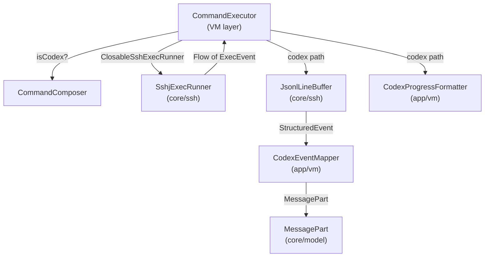
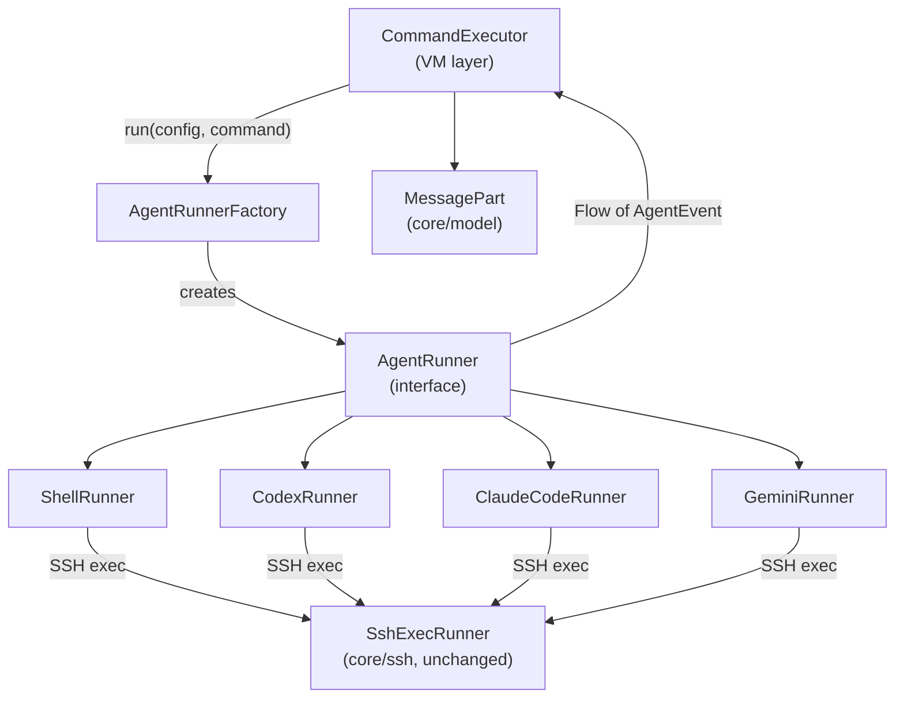

# AgentRunner Abstraction Layer Design

> RikkaAgent multi-backend AI CLI runner abstraction.
>
> Last updated: 2026-06-23

---

## 1. Problem Statement

当前 `CommandExecutor` 通过 `isCodex: Boolean` 分支来区分普通 shell 模式和 Codex JSONL 模式。每新增一种 AI CLI 工具（Claude Code、Gemini 等），都需要在 `CommandExecutor` 中添加新的分支逻辑，导致：

- 命令包装逻辑（`CommandComposer`）与 VM 层耦合
- 输出解析逻辑（`JsonlLineBuffer` + `CodexEventMapper`）散落在 `core/ssh` 和 `app/vm` 两层
- 进度展示逻辑（`CodexProgressFormatter`）硬编码 Codex 事件格式
- `CommandExecutor.execute()` 已超过 150 行，分支复杂度持续增长

**目标**：引入 `AgentRunner` 接口，将每种 AI CLI 的行为封装为独立实现，`CommandExecutor` 只依赖统一接口。

---

## 2. Current Architecture (Before)



问题：`CommandExecutor` 同时承担了 SSH 生命周期管理、命令包装选择、输出解析分发、进度追踪、渲染等职责。

---

## 3. Target Architecture (After)



`CommandExecutor` 只做三件事：(1) 持有 `AgentRunner` 实例，(2) 收集 `AgentEvent` 流，(3) 映射到 `MessagePart` 更新 UI。

---

## 4. Core Types

### 4.1 AgentType

```kotlin
enum class AgentType {
    SHELL,       // plain SSH command
    CODEX,       // codex exec --json
    CLAUDE_CODE, // claude --output-format stream-json
    GEMINI,      // gemini --output-format json
}
```

### 4.2 AgentConfig

替代当前 `SshProfile` 上散落的 `codexMode`/`codexWorkDir`/`codexApiKey` 字段。

```kotlin
data class AgentConfig(
    val type: AgentType,
    val workDir: String? = null,
    val apiKey: String? = null,
    val model: String? = null,           // e.g. "o4-mini", "claude-sonnet-4-20250514"
    val maxTokens: Int? = null,
    val autoApprove: Boolean = false,    // --full-auto / --dangerously-skip-permissions
    val extraEnv: Map<String, String> = emptyMap(),
    val extraArgs: List<String> = emptyList(),
)
```

`SshProfile` 保留 SSH 连接参数（host/port/auth），`AgentConfig` 描述 AI CLI 行为。两者在 `CommandExecutor.execute()` 中组合使用。

### 4.3 AgentEvent

统一事件模型，每个 Runner 将各自的 CLI 输出解析为这组事件。

```kotlin
sealed class AgentEvent {
    /** 流式文本增量（普通输出或 AI 回复文本）。 */
    data class TextDelta(val text: String) : AgentEvent()

    /** 推理过程增量（thinking / reasoning）。 */
    data class ReasoningDelta(val text: String, val stepId: String? = null) : AgentEvent()

    /** 代码块增量。 */
    data class CodeDelta(val code: String, val language: String? = null) : AgentEvent()

    /** 工具调用开始（function call / tool_use）。 */
    data class ToolCallStart(
        val toolName: String,
        val toolInput: String? = null,
    ) : AgentEvent()

    /** 工具调用结果。 */
    data class ToolCallResult(
        val toolName: String,
        val output: String,
        val isError: Boolean = false,
    ) : AgentEvent()

    /** 进度更新（turn/thread/step 等结构性进度）。 */
    data class Progress(
        val phase: String,      // e.g. "thinking", "executing", "summarizing"
        val detail: String? = null,
    ) : AgentEvent()

    /** 状态变更（status string for display）。 */
    data class Status(val text: String) : AgentEvent()

    /** stderr 输出。 */
    data class Stderr(val text: String) : AgentEvent()

    /** 命令执行完成。 */
    data class Exit(val code: Int?) : AgentEvent()

    /** 命令被用户取消。 */
    data object Canceled : AgentEvent()

    /** 连接或执行错误。 */
    data class Error(val category: String, val message: String) : AgentEvent()
}
```

### 4.4 AgentRunner 接口

```kotlin
interface AgentRunner {
    /** Runner 类型标识。 */
    val type: AgentType

    /**
     * 执行命令，返回事件流。
     *
     * @param profile SSH 连接配置（host/port/auth）。
     * @param config  AI CLI 行为配置（workDir/apiKey/model 等）。
     * @param command 用户输入的原始命令/提示词。
     * @return 冷流，collect 时发起 SSH 连接并执行。
     */
    fun run(profile: SshProfile, config: AgentConfig, command: String): Flow<AgentEvent>

    /** 取消当前执行。实现应中断 SSH 会话。 */
    fun cancel()

    /** 释放资源（SSH 连接池等）。 */
    fun close()
}
```

### 4.5 AgentRunnerFactory

```kotlin
interface AgentRunnerFactory {
    fun create(type: AgentType): AgentRunner
}

class DefaultAgentRunnerFactory(
    private val sshRunnerFactory: SshExecRunnerFactory,
    private val knownHostsStore: KnownHostsStore,
    private val hostKeyCallback: HostKeyCallback,
    private val passwordProvider: PasswordProvider?,
    private val keyContentProvider: KeyContentProvider?,
    private val passphraseProvider: PassphraseProvider?,
) : AgentRunnerFactory {
    override fun create(type: AgentType): AgentRunner = when (type) {
        AgentType.SHELL -> ShellRunner(/* ssh deps */)
        AgentType.CODEX -> CodexRunner(/* ssh deps */)
        AgentType.CLAUDE_CODE -> ClaudeCodeRunner(/* ssh deps */)
        AgentType.GEMINI -> GeminiRunner(/* ssh deps */)
    }
}
```

---

## 5. Runner Implementations

### 5.1 ShellRunner

**对应当前行为**：`isCodex = false` 时的 `CommandComposer.wrapWithShell()` + 原始 stdout/stderr 流。

| 维度 | 策略 |
|------|------|
| **命令包装** | `wrapWithShell(command, shell)` — 与当前 `CommandComposer.wrapWithShell` 相同 |
| **输出解析** | 直接透传 `ExecEvent.StdoutChunk` → `AgentEvent.TextDelta`，`ExecEvent.StderrChunk` → `AgentEvent.Stderr`。不做 JSONL 解析 |
| **进度展示** | 无结构化进度。仅在 `Exit` 时更新最终状态 |
| **错误处理** | `ExecEvent.Error` → `AgentEvent.Error`，保留 category 映射（connection_refused / timeout / unknown_host / auth_failed） |

```kotlin
class ShellRunner(/* ssh deps */) : AgentRunner {
    override val type = AgentType.SHELL

    override fun run(profile: SshProfile, config: AgentConfig, command: String): Flow<AgentEvent> {
        val shellCommand = CommandComposer.wrapWithShell(command, config.shell ?: "/bin/sh")
        return sshExecRunner.run(profile, shellCommand).map { event ->
            when (event) {
                is ExecEvent.StdoutChunk -> AgentEvent.TextDelta(String(event.bytes, UTF_8))
                is ExecEvent.StderrChunk -> AgentEvent.Stderr(String(event.bytes, UTF_8))
                is ExecEvent.Exit -> AgentEvent.Exit(event.code)
                is ExecEvent.Canceled -> AgentEvent.Canceled
                is ExecEvent.Error -> AgentEvent.Error(event.category, event.message)
                is ExecEvent.StructuredEvent -> null // ignore
            }
        }.filterNotNull()
    }
}
```

### 5.2 CodexRunner

**对应当前行为**：`isCodex = true` 时的完整 Codex JSONL 处理链。

| 维度 | 策略 |
|------|------|
| **命令包装** | `codex exec --json --full-auto "$task"` + `cd $workDir &&` + `OPENAI_API_KEY=$key`。与当前 `CommandComposer.wrapForCodex` 相同 |
| **输出解析** | `JsonlLineBuffer` 行分割 → `JsonlParser.parseLine()` → `CodexEventMapper.mapToPart()` 映射：`reasoning` → `ReasoningDelta`，`code` → `CodeDelta`，text fields → `TextDelta`，`thread.*/turn.*/item.*` → `Progress` |
| **进度展示** | `CodexProgressFormatter` 提取 thread/turn/item 三级进度 → `AgentEvent.Progress`。当前 `CodexProgressState` 逻辑不变 |
| **错误处理** | 同 ShellRunner。Codex 自身的 JSON 错误（如 API key 无效）通过 stderr 或 JSON `error` 字段传递 |

```kotlin
class CodexRunner(/* ssh deps */) : AgentRunner {
    override val type = AgentType.CODEX

    override fun run(profile: SshProfile, config: AgentConfig, command: String): Flow<AgentEvent> {
        val shellCommand = CommandComposer.wrapForCodex(
            task = command,
            workDir = config.workDir,
            apiKey = config.apiKey,
        )
        val jsonlBuffer = JsonlLineBuffer()

        return sshExecRunner.run(profile, shellCommand).transform { event ->
            when (event) {
                is ExecEvent.StdoutChunk -> {
                    val parsed = jsonlBuffer.feed(event.bytes)
                    for (e in parsed) emitAll(mapExecEvent(e))
                }
                is ExecEvent.Exit -> {
                    for (e in jsonlBuffer.flush()) emitAll(mapExecEvent(e))
                    emit(AgentEvent.Exit(event.code))
                }
                is ExecEvent.StderrChunk -> emit(AgentEvent.Stderr(String(event.bytes, UTF_8)))
                is ExecEvent.Canceled -> emit(AgentEvent.Canceled)
                is ExecEvent.Error -> emit(AgentEvent.Error(event.category, event.message))
                is ExecEvent.StructuredEvent -> emitAll(mapStructuredEvent(event))
            }
        }
    }

    private fun mapStructuredEvent(event: ExecEvent.StructuredEvent): Flow<AgentEvent> = flow {
        when (event.kind) {
            "json" -> {
                CodexEventMapper.mapToPart(event.rawJson)?.let { part ->
                    when (part) {
                        is MessagePart.Reasoning -> emit(AgentEvent.ReasoningDelta(part.text, part.stepId))
                        is MessagePart.Code -> emit(AgentEvent.CodeDelta(part.code, part.language))
                        is MessagePart.Text -> emit(AgentEvent.TextDelta(part.text))
                        else -> {}
                    }
                }
                CodexProgressFormatter.extractProgress(event.rawJson)?.let { progress ->
                    emit(AgentEvent.Progress(progress.phase, progress.detail))
                }
            }
            "markdown_delta" -> emit(AgentEvent.TextDelta(event.rawJson))
            "status" -> emit(AgentEvent.Status(event.rawJson))
        }
    }
}
```

### 5.3 ClaudeCodeRunner

**新增**：Claude Code CLI 的 `stream-json` 输出格式。

| 维度 | 策略 |
|------|------|
| **命令包装** | `claude --output-format stream-json -p "$prompt"` + 可选 `--model`, `--max-tokens`, `--dangerously-skip-permissions`。环境变量 `ANTHROPIC_API_KEY=$key`。`cd $workDir &&` 前缀 |
| **输出解析** | NDJSON 流，每行一个 JSON 对象。按 `type` 字段分发：`assistant` (content blocks) → 提取 `thinking` → `ReasoningDelta`，`text` → `TextDelta`，`tool_use` → `ToolCallStart`，`tool_result` → `ToolCallResult`；`result` → 最终结果；`system`/`error` → `Status`/`Error` |
| **进度展示** | `type: "system"` 事件中的 `subtype` 字段（`init`, `processing` 等）→ `AgentEvent.Progress` |
| **错误处理** | `type: "error"` 事件 → `AgentEvent.Error`。API 层面的错误（rate limit、auth）通过 stderr 或 JSON error 传递 |

```kotlin
class ClaudeCodeRunner(/* ssh deps */) : AgentRunner {
    override val type = AgentType.CLAUDE_CODE

    override fun run(profile: SshProfile, config: AgentConfig, command: String): Flow<AgentEvent> {
        val shellCommand = buildClaudeCommand(command, config)
        val lineBuffer = JsonlLineBuffer() // 复用行缓冲

        return sshExecRunner.run(profile, shellCommand).transform { event ->
            when (event) {
                is ExecEvent.StdoutChunk -> {
                    val lines = lineBuffer.feed(event.bytes)
                    for (line in lines) emitAll(parseClaudeLine(line))
                }
                is ExecEvent.Exit -> {
                    for (line in lineBuffer.flush()) emitAll(parseClaudeLine(line))
                    emit(AgentEvent.Exit(event.code))
                }
                // ... stderr, canceled, error same as CodexRunner
            }
        }
    }

    private fun buildClaudeCommand(prompt: String, config: AgentConfig): String {
        val parts = mutableListOf("claude", "--output-format", "stream-json", "-p", shellQuote(prompt))
        config.model?.let { parts.addAll(listOf("--model", it)) }
        config.maxTokens?.let { parts.addAll(listOf("--max-tokens", it.toString())) }
        if (config.autoApprove) parts.add("--dangerously-skip-permissions")
        parts.addAll(config.extraArgs)
        val cmd = parts.joinToString(" ")
        val envPart = config.apiKey?.let { "ANTHROPIC_API_KEY=${shellQuote(it)} " } ?: ""
        val cdPart = config.workDir?.let { "cd ${shellQuote(it)} && " } ?: ""
        return "${cdPart}${envPart}$cmd"
    }
}
```

**Claude Code `stream-json` 事件映射表**：

| Claude `type` | 子字段 | → AgentEvent |
|---------------|--------|--------------|
| `assistant` | `content[].type == "thinking"` | `ReasoningDelta(text)` |
| `assistant` | `content[].type == "text"` | `TextDelta(text)` |
| `assistant` | `content[].type == "tool_use"` | `ToolCallStart(name, input_json)` |
| `tool_result` | `content[].type == "text"` | `ToolCallResult(toolName, output)` |
| `tool_result` | `is_error == true` | `ToolCallResult(toolName, output, isError=true)` |
| `result` | `text` | `TextDelta(text)` (final) |
| `system` | `subtype` | `Progress(phase=subtype)` |
| `error` | `message` | `Error("claude_code", message)` |

### 5.4 GeminiRunner

**新增**：Gemini CLI 的 JSON 输出格式。

| 维度 | 策略 |
|------|------|
| **命令包装** | `gemini --output-format json "$prompt"` + 可选 `--model`。`cd $workDir &&` 前缀。API key 通过 `GOOGLE_API_KEY=$key` 或 `GEMINI_API_KEY=$key` 环境变量 |
| **输出解析** | Gemini CLI 的 `--output-format json` 输出为单个 JSON 对象（非流式 NDJSON）。解析 `candidates[0].content.parts[]`：`text` → `TextDelta`，`executableCode` → `CodeDelta`，`codeExecutionResult` → `ToolCallResult`。整体作为一次性结果返回 |
| **进度展示** | Gemini CLI 无流式进度事件。仅在最终 JSON 返回时发出完成状态 |
| **错误处理** | JSON 中的 `error` 字段 → `AgentEvent.Error`。stderr 输出 → `AgentEvent.Stderr` |

```kotlin
class GeminiRunner(/* ssh deps */) : AgentRunner {
    override val type = AgentType.GEMINI

    override fun run(profile: SshProfile, config: AgentConfig, command: String): Flow<AgentEvent> {
        val shellCommand = buildGeminiCommand(command, config)

        return flow {
            val stdout = StringBuilder()
            val stderr = StringBuilder()

            sshExecRunner.run(profile, shellCommand).collect { event ->
                when (event) {
                    is ExecEvent.StdoutChunk -> stdout.append(String(event.bytes, UTF_8))
                    is ExecEvent.StderrChunk -> stderr.append(String(event.bytes, UTF_8))
                    is ExecEvent.Exit -> {
                        // Gemini outputs a single JSON blob; parse on exit
                        emitAll(parseGeminiOutput(stdout.toString()))
                        if (stderr.isNotBlank()) emit(AgentEvent.Stderr(stderr.toString()))
                        emit(AgentEvent.Exit(event.code))
                    }
                    is ExecEvent.Canceled -> emit(AgentEvent.Canceled)
                    is ExecEvent.Error -> emit(AgentEvent.Error(event.category, event.message))
                    is ExecEvent.StructuredEvent -> {} // not used
                }
            }
        }
    }

    private fun parseGeminiOutput(jsonStr: String): Flow<AgentEvent> = flow {
        val obj = Json.parseToJsonElement(jsonStr).jsonObject
        val error = obj["error"]?.jsonObject
        if (error != null) {
            emit(AgentEvent.Error("gemini", error["message"]?.jsonPrimitive?.content ?: "Unknown error"))
            return@flow
        }
        val candidates = obj["candidates"]?.jsonArray ?: return@flow
        for (candidate in candidates) {
            val parts = candidate.jsonObject["content"]?.jsonObject?.get("parts")?.jsonArray ?: continue
            for (part in parts) {
                val partObj = part.jsonObject
                partObj["text"]?.jsonPrimitive?.contentOrNull?.let {
                    emit(AgentEvent.TextDelta(it))
                }
                partObj["executableCode"]?.jsonObject?.get("code")?.jsonPrimitive?.contentOrNull?.let {
                    val lang = partObj["executableCode"]?.jsonObject?.get("language")?.jsonPrimitive?.contentOrNull
                    emit(AgentEvent.CodeDelta(it, lang))
                }
                partObj["codeExecutionResult"]?.jsonObject?.let { result ->
                    val output = result["output"]?.jsonPrimitive?.contentOrNull ?: ""
                    val isError = result["outcome"]?.jsonPrimitive?.contentOrNull == "ERROR"
                    emit(AgentEvent.ToolCallResult("code_execution", output, isError))
                }
            }
        }
    }
}
```

---

## 6. Output Parsing Strategy Comparison

| Runner | 输出格式 | 流式粒度 | 解析时机 | 缓冲策略 |
|--------|----------|----------|----------|----------|
| **ShellRunner** | raw bytes | chunk-level | 实时 | 无缓冲，直接透传 |
| **CodexRunner** | NDJSON (`codex exec --json`) | 行级 JSON | 实时 | `JsonlLineBuffer` 行累积 |
| **ClaudeCodeRunner** | NDJSON (`stream-json`) | 行级 JSON | 实时 | `JsonlLineBuffer` 行累积 |
| **GeminiRunner** | 单 JSON 对象 | N/A（批量） | Exit 时 | `StringBuilder` 累积全部 stdout |

---

## 7. Progress Display Strategy Comparison

| Runner | 进度来源 | 粒度 | UI 展示 |
|--------|----------|------|---------|
| **ShellRunner** | 无 | N/A | 仅 spinner + elapsed time |
| **CodexRunner** | `thread.*`/`turn.*`/`item.*` JSON 事件 | 三级（thread → turn → item） | 折叠行："Thinking • #abc123" |
| **ClaudeCodeRunner** | `system.subtype` 事件 + `tool_use` 事件 | 二级（phase → tool） | 折叠行："Executing • Bash #tool_use_01" |
| **GeminiRunner** | 无流式进度 | N/A | spinner 直到 JSON 返回 |

---

## 8. Error Handling Strategy Comparison

| 错误类型 | ShellRunner | CodexRunner | ClaudeCodeRunner | GeminiRunner |
|----------|-------------|-------------|------------------|--------------|
| SSH 连接失败 | `Error(category, msg)` | 同左 | 同左 | 同左 |
| 认证失败 | `Error("auth_failed", ...)` | 同左 | 同左 | 同左 |
| API key 无效 | N/A | stderr + exit 1 | JSON `error` + exit 1 | JSON `error` + exit 1 |
| 超时 | `Error("timeout", ...)` | 同左 | 同左 | 同左 |
| CLI 未安装 | `Error("ssh_error", "command not found")` | 同左 | 同左 | 同左 |
| JSON 解析失败 | N/A | fallback 到 TextDelta | fallback 到 TextDelta | `Error("parse", ...)` |
| 用户取消 | `Canceled` | `Canceled` + flush buffer | `Canceled` + flush buffer | `Canceled` |

所有 Runner 共享 SSH 层的错误分类逻辑（`SshjExecRunner` 中的 `category` 映射）。CLI 特有错误（API 限额、模型拒绝等）通过 stderr 或 JSON `error` 字段向上冒泡。

---

## 9. CommandExecutor Refactoring

### 9.1 Before (simplified)

```kotlin
// CommandExecutor.execute() — 当前
fun execute(command, assistantId, isCodex, ...) {
    val shellCommand = if (isCodex) {
        CommandComposer.wrapForCodex(command, profile.codexWorkDir, profile.codexApiKey)
    } else {
        wrapWithShell(command)
    }
    runningJob = scope.launch {
        execRunner.run(profile, shellCommand).collect { event ->
            when (event) {
                is ExecEvent.StdoutChunk -> {
                    if (isCodex) { /* 30 lines of Codex parsing */ }
                    else { /* plain output */ }
                }
                // ... more isCodex branches
            }
        }
    }
}
```

### 9.2 After (simplified)

```kotlin
// CommandExecutor.execute() — after refactoring
fun execute(command: String, assistantId: String, agentConfig: AgentConfig, ...) {
    val profile = currentProfile ?: return
    runningJob?.cancel()
    _connectionState.value = ConnectionState.EXECUTING

    val runner = agentRunnerFactory.create(agentConfig.type)
    activeRunner = runner

    runningJob = scope.launch {
        val parts = mutableListOf<MessagePart>()
        var progressState: ProgressState? = null

        runner.run(profile, agentConfig, command).collect { event ->
            when (event) {
                is AgentEvent.TextDelta -> { /* append to Text part or create new */ }
                is AgentEvent.ReasoningDelta -> { /* append to Reasoning part */ }
                is AgentEvent.CodeDelta -> { /* create/update Code part */ }
                is AgentEvent.ToolCallStart -> { /* add tool call indicator */ }
                is AgentEvent.ToolCallResult -> { /* add tool result */ }
                is AgentEvent.Progress -> { progressState = event.toProgressState() }
                is AgentEvent.Status -> { /* update status line */ }
                is AgentEvent.Stderr -> { /* append to stderr */ }
                is AgentEvent.Exit -> { /* finalize message, set MessageStatus.Final */ }
                is AgentEvent.Canceled -> { /* set MessageStatus.Canceled */ }
                is AgentEvent.Error -> { /* set MessageStatus.Error, update ConnectionError */ }
            }
            updateContent(assistantId, renderParts(parts, progressState))
        }
    }
}
```

`isCodex` 分支完全消除。新增 AI CLI 只需添加一个 `AgentRunner` 实现，`CommandExecutor` 零改动。

---

## 10. Migration Path

### Phase 1: Extract interface (non-breaking)

1. 在 `core/model` 中添加 `AgentType`、`AgentConfig`、`AgentEvent` 类型
2. 在 `core/ssh` 中添加 `AgentRunner` 接口和 `AgentRunnerFactory`
3. 实现 `ShellRunner`，包装现有 `SshExecRunner` + `SshOutputMapper` 行为
4. 实现 `CodexRunner`，从 `CommandExecutor` 中提取 Codex 解析逻辑
5. `CommandExecutor` 同时支持旧路径（`isCodex`）和新路径（`AgentRunner`），通过 feature flag 切换

### Phase 2: Migrate CommandExecutor

6. `CommandExecutor.execute()` 改为接收 `AgentConfig` 替代 `isCodex: Boolean`
7. 移除 `CommandExecutor` 中的 `isCodex` 分支和内联 Codex 解析代码
8. `CodexEventMapper`、`CodexProgressFormatter` 移入 `CodexRunner` 内部或 `core/agent` 模块

### Phase 3: Add new runners

9. 实现 `ClaudeCodeRunner`
10. 实现 `GeminiRunner`
11. UI 层添加 Agent 类型选择器（Profile 设置页面）

### Phase 4: Cleanup

12. 移除 `CommandComposer.wrapForCodex()`（已内化到 `CodexRunner`）
13. 移除 `SshProfile.codexMode`/`codexWorkDir`/`codexApiKey`（迁移到 `AgentConfig`）
14. `SshOutputMapper` 可选择保留（供 `ShellRunner` 使用）或内化

---

## 11. Module Placement

```
core/
  model/          ← AgentType, AgentConfig, AgentEvent (已有 MessagePart)
  ssh/            ← AgentRunner interface, AgentRunnerFactory
                   ShellRunner, CodexRunner (依赖 JsonlParser)
  agent/          ← (new, optional) ClaudeCodeRunner, GeminiRunner
                   避免 core/ssh 依赖 Claude/Gemini 特定解析逻辑
app/
  vm/             ← CommandExecutor (refactored), AgentRunner selection UI
```

如果不想新建 `core/agent` 模块，所有 Runner 也可以放在 `core/ssh` 中（它们都依赖 `SshExecRunner` + `ExecEvent`）。模块拆分取决于 Runner 数量是否会继续增长。

---

## 12. Key Design Decisions

| 决策 | 理由 |
|------|------|
| `AgentEvent` 粒度细于 `MessagePart` | `AgentEvent` 是流式增量（delta），`MessagePart` 是累积态。Runner 产出 delta，CommandExecutor 累积为 Part |
| Runner 接收 `SshProfile` + `AgentConfig` 两个参数 | SSH 连接配置与 AI CLI 配置正交，不应合并到一个 data class |
| `cancel()` 在 Runner 级别而非 SSH 级别 | 不同 Runner 可能需要不同的取消语义（如 Claude Code 需要发送 SIGINT 而非直接断连） |
| `close()` 独立于 `cancel()` | Runner 可能持有连接池等长生命周期资源，cancel 后仍可复用 |
| GeminiRunner 在 Exit 时批量解析 | Gemini CLI `--output-format json` 不是流式输出，无法逐行解析。如果未来 Gemini 支持流式，可改为逐行 |
| 复用 `JsonlLineBuffer` 给 ClaudeCodeRunner | Claude Code 的 `stream-json` 也是 NDJSON 行格式，行缓冲逻辑完全通用 |

---

## 13. Open Questions

1. **Gemini 流式支持**：Gemini CLI 是否有 `--output-format stream-json` 或等效选项？如有，`GeminiRunner` 应改为流式解析。
2. **Claude Code tool_use 渲染**：`ToolCallStart`/`ToolCallResult` 是否需要新的 `MessagePart` 子类型？当前 `MessagePart` 没有 tool call 类型。
3. **Runner 并发**：是否允许同时运行多个 Runner（不同 profile）？当前 `CommandExecutor` 只支持单任务。
4. **配置持久化**：`AgentConfig` 是否需要持久化到 Room DB？还是每次会话重新配置？
5. **`AgentConfig.shell` 字段**：`ShellRunner` 需要 shell 配置，但其他 Runner 不需要。是否放在 `AgentConfig` 中还是保持在 `SshProfile`/`AppPreferences` 中？
